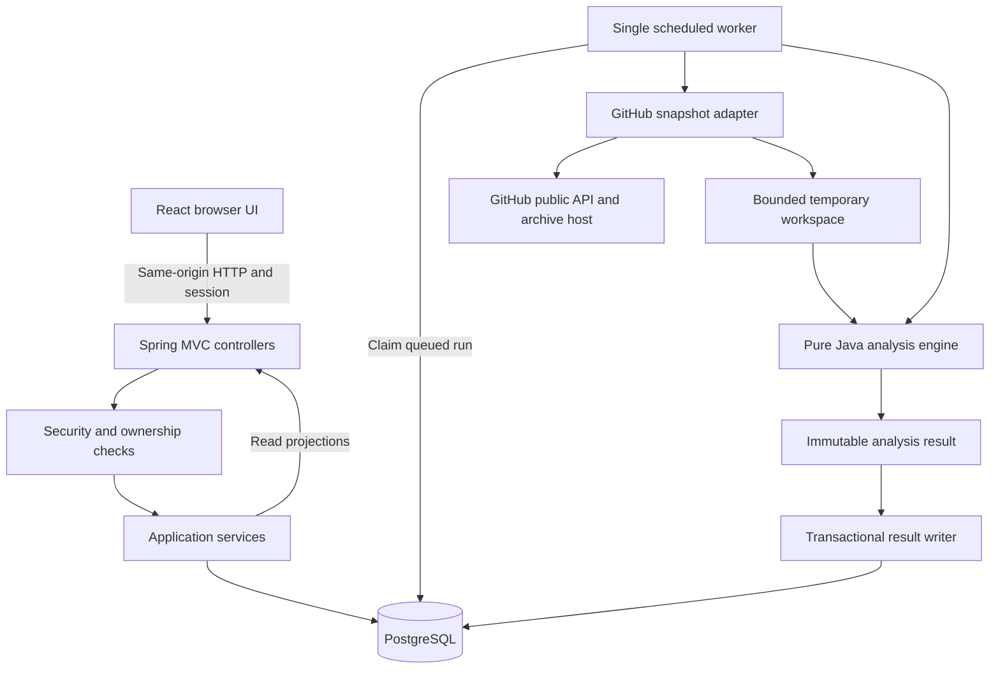
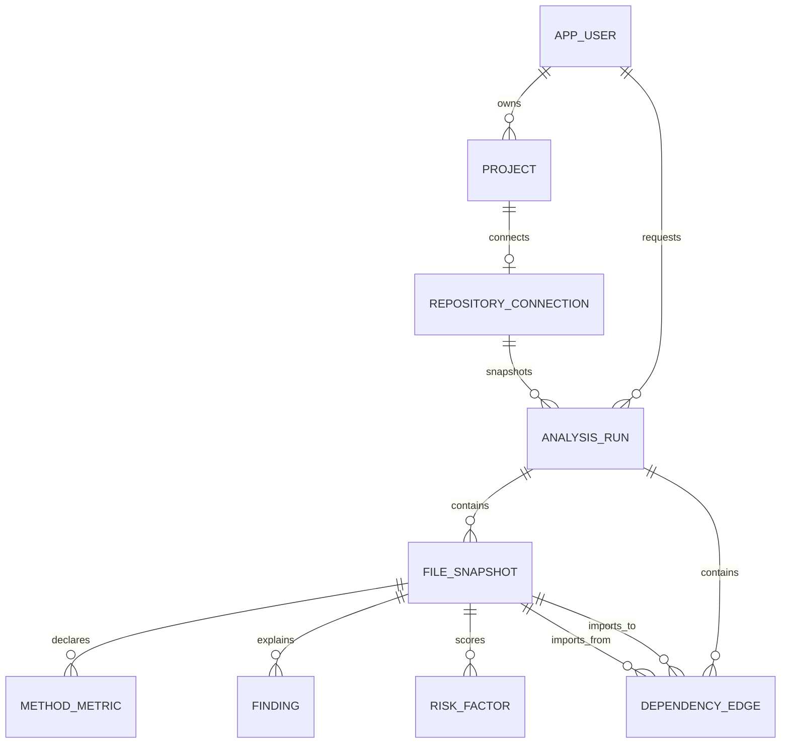
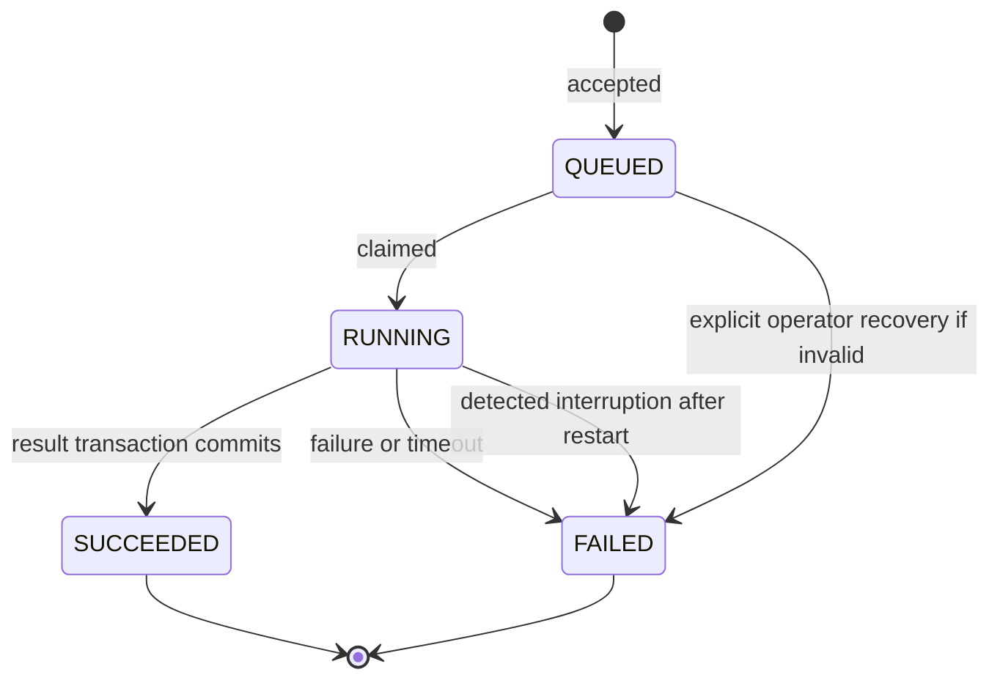

# CodePulse — Engineering blueprint and learning roadmap

**Audience:** a Core Java beginner with existing React/TypeScript experience, building with Claude Max.  
**Specification:** 1.0 · **Prepared:** 17 September 2026 · **Status:** proposed design, not implemented software.  
**Primary outcome:** an explainable Java repository analyzer that you can build, test, demonstrate, and defend in interviews.

This document is the product and architecture authority. [API-Contract.md](API-Contract.md) defines requests, responses, and errors. [Database-Schema.sql](Database-Schema.sql) is the reference schema. [Claude-Build-Playbook.md](../../Claude-Build-Playbook.md) contains copy-ready prompts for every phase and the rules for working with Claude. Read sections 1–5 first; implement only the phase you have reached. The complete design describes the destination, not a request to generate the entire application immediately.

## Contents

1. Critical evaluation and recommendation
2. Product definition
3. Scope, releases, and difficulty
4. Roles and end-to-end flows
5. Technology choices and architecture
6. Backend organization and internals
7. Database design
8. REST API design
9. Deterministic analysis engine
10. Explainable risk and health
11. Security and repository handling
12. Background processing and reliability
13. React experience
14. Testing and acceptance criteria
15. Docker and local operation
16. Deployment at approximately ₹0
17. Git, GitHub, and documentation
18. Learning and implementation roadmap
19. Working effectively with Claude Max
20. Interview preparation: 84 questions
21. Resume, README, and LinkedIn positioning
22. Scope controls and release checklist
23. Architecture decisions and alternatives
24. Glossary and official references

---

## 1. Critical evaluation and recommendation

**Build CodePulse, but make its first release “explainable structural analysis for small Java repositories.”** The unrestricted original idea is too large for a beginner on a short timeline. Multi-language parsing, accurate call graphs, Git history, near-duplicate detection, private repository permissions, and public background workers are separate engineering problems. Combining all of them would make finishing and understanding the project unlikely.

The narrower version is a good match because parsing, collections, graph traversal, relational data, HTTP, transactions, authentication, asynchronous work, and tests all have visible product uses. The product has more substance than CRUD while still needing the backend fundamentals employers expect. Your existing frontend experience lets you spend most learning time on Java.

The category is not unprecedented: established static-analysis tools already exist. Do not pitch CodePulse as replacing SonarQube, PMD, or commercial code intelligence. Its portfolio distinction is the implementation you can explain: a reproducible analysis snapshot, explicit measurement definitions, an evidence panel for each finding, and visible limits on what was analyzed. The application uses a parser library; you implement the metric collectors, orchestration, graph aggregation, prioritization policy, and product around it.

### Changes to the original idea

| Original ambition | First-release decision | Reason |
|---|---|---|
| Any software repository | Java source, language level 21, preview features disabled | One language can be tested properly |
| Connect a repository | Public GitHub metadata plus a pinned source archive; initially your own small fixtures | No OAuth, secret storage, or Git execution in MVP |
| Understand all dependencies | An explicitly labeled **internal import graph** | Imports do not prove calls or runtime wiring |
| Predict engineering risk | Explain structural attention signals with a versioned policy | No unsupported claim of defect prediction |
| Overall health percentage | A profile of coverage, complexity, hotspots, and size | A single green number conceals missing data |
| Always-on free analysis SaaS | Full local app plus a stable hosted sample report | Free compute is unsuitable for unrestricted analysis |
| Big distributed platform | One Spring Boot deployment, one PostgreSQL database | Learn the fundamentals before distributed systems |

### Delivery expectation

Budget **140–195 focused hours** for the portfolio MVP, including learning and debugging. This is an estimate, not a promise. At roughly 25–30 hours a week, aim for 6–8 weeks; at 15 hours a week, expect about 10–13 weeks. Claude can accelerate typing but does not remove the time needed to understand unfamiliar concepts.

After 40–60 hours, aim to have a demonstrable analyzer and basic API. Begin applications once you can explain that work honestly; do not wait for V1 or every interview answer. If your deadline is under three weeks, ship the analyzer, file report, and a small local UI first, document it as an in-progress project, and postpone accounts and remote ingestion. Never deploy that unauthenticated learning checkpoint publicly.

## 2. Product definition

**Name:** CodePulse.  
**One line:** A Java codebase explorer that turns static measurements into traceable engineering review priorities.

**Problem:** A developer entering a repository needs to find its important packages, unusually complex methods, large files, and heavily connected code. Raw file lists and unexplained quality scores do not provide enough context to decide where to look first.

**Target users:** developers onboarding to small Java projects, students reviewing their own code, maintainers planning a refactor, and reviewers investigating a proposed change. The initial target is one developer and a repository with hundreds, not millions, of source lines per file.

**Core value:** “Show me where to start reading, why it deserves attention, and what evidence supports that suggestion.” Every snapshot records the exact commit, analyzer version, metric definition, graph mode, and policy. Results remain understandable even when the repository changes later.

**Primary product questions:**

1. What Java code was successfully analyzed?
2. Which methods and files deserve inspection first?
3. Which files explicitly import this type?
4. What does the evidence support, and what remains unknown?
5. In V1, how did these measurements change between comparable snapshots?

**Success criteria:** a user can analyze an owned sample repository, explain three findings using evidence, reach a specific method and GitHub line link, and reproduce the same metrics from the same commit and configuration. Success is measured by correctness and usability, not the number of dashboard widgets.

**Non-goals:** security vulnerability scanning, running repository tests, executing builds, detecting all bugs, evaluating developer productivity, production incident prediction, AI chat, and large-scale enterprise governance.

## 3. Scope, releases, and difficulty

Difficulty labels describe the feature after its prerequisites: **B** = beginner, **I** = intermediate, **A** = advanced. “MVP” below means the finished portfolio MVP; the early local analyzer is an internal learning checkpoint.

| Feature | Release | Difficulty | Definition of done |
|---|---|---:|---|
| Trusted local fixture analyzer | Learning checkpoint | B→I | CLI/test harness produces expected metrics |
| File inventory and exclusions | MVP | B | Counts distinguish discovered, eligible, skipped, and failed |
| Java type/method/constructor counts | MVP | I | AST fixtures cover interfaces, records, nesting, and overloads |
| Physical LOC and source LOC | MVP | I | Token-based source lines; text blocks and comments tested |
| Method complexity and size | MVP | I | Published counting rules and hand-checked fixtures |
| TODO/FIXME markers | MVP | B→I | Searches comment tokens only, with line evidence |
| Internal explicit import graph | MVP | I | Unique file edges, unresolved imports reported |
| Transparent review priorities | MVP | I | Factor contributions and policy version visible |
| Public GitHub snapshot retrieval | MVP | I | Pinned commit, strict limits, safe archive handling |
| Register/login/logout and ownership | MVP | I | Two-user isolation and CSRF tests pass |
| Projects; one repository per project | MVP | B→I | Owner-scoped APIs and database constraints |
| Queued job, stage progress, failure recovery | MVP | I | Durable queued jobs; interrupted jobs fail clearly |
| Overview, hotspots, file detail, import lists | MVP | B→I | Complete end-to-end UI with error states |
| Saved run history list and JSON export | MVP | I | Immutable completed snapshots; bounded export |
| Docker, CI, sample report, documentation | MVP | I | Fresh-clone setup and CI succeed |
| Package graph visualization and impact candidates | V1 | I | Reverse traversal, limits, direction legend |
| Compare two snapshots | V1 | I | Only comparable policies/configurations get score deltas |
| Basic Git activity | V1, choose after comparison | I→A | Bounded history with coverage and exclusions |
| Exact token duplicates / PMD CPD | V1, choose one | I→A | Clone definition and false positives documented |
| Admin operations screen | V1 | I | Sanitized job metadata, no owner-data bypass |
| Source type resolution with Symbol Solver | V2 | A | Resolution evidence and unresolved states |
| Isolated workers for arbitrary submitted repositories | V2 | A | Hard resource isolation and crash/retry tests |
| Private repositories / GitHub App | V2 | A | Least-privilege installation access and revocation |
| Multi-language analyzers | V2 | A | Independent language contracts and fixtures |
| Near-duplicate AST matching, call graph | V2 | A | Accuracy limitations evaluated explicitly |
| Webhooks, PR comments, team workspaces | Optional | A | Only after a real user needs them |
| Optional AI explanation adapter | Optional | A | Disabled by default; deterministic report remains complete |

Do not implement all V1 options. After the MVP, **snapshot comparison** is the best next feature: it reuses existing data and demonstrates backend query design without introducing another ingestion system.

## 4. Roles and end-to-end flows

### Roles

| Role | Allowed actions | Limits |
|---|---|---|
| Anonymous visitor | View landing page and bundled sample report; register/login when enabled | Cannot list real users, projects, jobs, or reports |
| USER | Manage own projects, connect a repository, request scans, view/export own results, delete own completed data | No access to another user's identifiers |
| ADMIN | Everything a USER can do for their own data; V1 system queue/failure summaries | Does not automatically read other users' file-level results |

MVP stores the role for security tests but has no admin dashboard. Bootstrap an admin with an operator-only development command or migration task; never accept `role` during registration. Public demo deployments have registration and analysis disabled unless explicitly configured.

### Flow A — account and first analysis

1. Browser fetches a CSRF token. User registers with email, display name, and password.
2. User logs in; Spring Security creates/rotates the session. Browser fetches a fresh CSRF token.
3. User creates a project, for example “Payments learning repo.”
4. User connects a public GitHub repository using owner and name. UI may parse a pasted GitHub URL into these fields; the server independently validates them.
5. Backend verifies public visibility and saves canonical metadata. “Connected” means a public source link, not access to the user's GitHub account.
6. User starts an analysis. API commits a `QUEUED` run and returns `202` plus its status URL.
7. Worker resolves the default branch once to a commit SHA, downloads that snapshot, inventories, parses, links imports, evaluates signals, and persists results.
8. UI polls stage/counts; completion opens overview. Warnings remain visible.
9. User opens a hotspot, inspects factor contributions, methods, and incoming/outgoing imports, then follows a commit-pinned source link.
10. User exports a JSON report. A later scan creates a new run rather than editing this one.

### Flow B — failure and retry

Rate limit, too-large archive, no Java files, unsupported syntax, partial parse, network interruption, and process restart are distinct outcomes. The UI displays a short explanation and whether retry could help. Retry creates a **new run** through the normal start endpoint; it never resets an old completed/failed record. Partial parsing can produce `SUCCEEDED` with warnings and explicit coverage, but zero successfully parsed Java files produces `FAILED / NO_ANALYZABLE_JAVA`.

### Flow C — inspect results

Overview → high-priority file table → method evidence → import relationships → pinned source. “Dependency analysis” is named “Imports” in the MVP UI. The history page lists commit, time, coverage, and policy. V1 adds baseline/current selection, file deltas, and package graph traversal.

### Flow D — delete and retention

Delete a completed run or project with no queued/running jobs. A project deletion cascades to its repository and snapshots in a transaction. Return `409 ACTIVE_ANALYSIS` while work is active. MVP retains at most ten terminal runs per repository; after a successful run, an operator retention task removes the oldest excess terminal runs. Never remove active jobs. Give the UI a clear notice before destructive deletion.

## 5. Technology choices and architecture

### Selected stack

| Technology | Purpose | When introduced |
|---|---|---|
| Java 21 LTS | Backend and analyzer language; records, collections, NIO, concurrency | Phase 0 |
| Maven Wrapper | Reproducible build and dependency management | Phase 0 |
| JavaParser core | Parse Java syntax into an AST | Phase 2 |
| Spring Boot / Spring MVC | Application setup, dependency injection, REST | Phase 4 |
| Bean Validation | Validate input DTOs at API boundaries | Phase 4 |
| PostgreSQL + Spring Data JPA/Hibernate | Store accounts, snapshots, findings, and relationships | Phase 5 |
| Flyway | Version-controlled database migrations | Phase 5 |
| Spring Security | Password authentication, sessions, CSRF, authorization | Phase 6 |
| Apache Commons Compress | Inspect ZIP metadata and perform bounded extraction | Phase 7 |
| React + TypeScript + Vite | Product UI; use your existing skills | Phase 9 |
| CSS modules or Tailwind | Consistent components and layout; choose one | Phase 9 |
| JUnit Jupiter, Mockito, Spring Boot Test, MockMvc | Tests at appropriate boundaries | From Phase 1 |
| Testcontainers PostgreSQL | Real-database integration tests | Phase 5 |
| Docker Compose + GitHub Actions | Repeatable local environment and CI | Phase 10 |

**Version baseline:** Java 21 with Spring Boot **4.1.1** is compatible according to the official system requirements checked for this document. Use a stable patch in that line when starting, record it in the POM, and let Boot manage its dependency versions. Do not choose a preview release. Boot 4 tutorial imports and test modules can differ from Boot 3; generate the application from Spring Initializr and use documentation matching the selected version. [Spring Boot requirements](https://docs.spring.io/spring-boot/system-requirements.html)

The JavaParser repository currently documents **3.28.2** and distinguishes the core parser from its symbol-solver module. Pin and verify the actual core artifact in Phase 2; our intentionally smaller support contract is Java 21 without previews, regardless of newer syntax the library may support. [JavaParser official repository](https://github.com/javaparser/javaparser)

Use PostgreSQL 17 as a conservative project baseline, pin current patch images/digests at implementation time, and use the same major in tests. React/Vite versions should be stable and locked in `package-lock.json`; avoid hand-pinning unrelated Spring transitive dependencies. This specification does not claim that every listed major is the newest available release.

**Not selected:** Redis, Kafka, RabbitMQ, Elasticsearch, Neo4j, microservices, Kubernetes, GraphQL, Lombok, MapStruct, WebFlux, native images, and paid AI APIs. They either solve an absent problem or hide fundamentals you need to learn. Basic graph storage fits PostgreSQL; a bounded worker fits one process. Add a dependency only when you can name the problem it resolves.

### Architecture



There are two paths. HTTP services validate and read/write application data. The worker acquires source and calls the engine. **The engine does not make HTTP calls, use JPA entities, know about login, or query the database.** This boundary lets you learn it with plain Java and test it without Spring.

MVP is a modular monolith: one application with clear package responsibilities. This is an organizational choice, not a promise of distributed-system scalability. The scheduler is a database-backed queue consumer; Redis and a broker are unnecessary at one worker. PostgreSQL stores persistent results; temporary source files are deleted after each run.

## 6. Backend organization and internals

Use one Maven backend module at first. Organize by feature, with an explicitly separated engine package:

```text
codepulse/
  backend/
    pom.xml, mvnw, mvnw.cmd, .mvn/
    src/main/java/dev/codepulse/
      CodePulseApplication.java
      auth/        RegistrationController, CsrfController, AccountService, AppUser
      project/     ProjectController, ProjectService, ProjectRepository, Project
      source/      RepositoryController, RepositoryService, GitHubClient,
                   ArchiveExtractor, RepositoryConnection, RepositoryConnectionRepository
      analysis/    AnalysisController, AnalysisService, AnalysisRunRepository,
                   AnalysisWorker, RunLifecycleService, ResultWriter, AnalysisRun
      report/      ReportController, ReportQueryService, FileSnapshotRepository,
                   FileSnapshot, MethodMetric, DependencyEdge, Finding, RiskFactor
      engine/      SourceInventory, JavaSourceAnalyzer, ComplexityVisitor,
                   ImportGraphBuilder, RiskPolicy, AnalysisResult, FileMetrics
      config/      SecurityConfig, AnalysisProperties, WebConfig
      common/      ApiExceptionHandler, ProblemCode, ClockConfig
    src/main/resources/
      application.yml
      db/migration/
    src/test/java/...
    src/test/resources/fixtures/...
  frontend/
  docs/            architecture, metric rules, decisions, learning log
  infra/           Dockerfiles, compose.yaml, nginx.conf
  .github/workflows/ci.yml
  README.md, CLAUDE.md, .env.example, .gitignore
```

Place each feature's request/response records in `dto/` subpackages only when the file count warrants it. Avoid a giant shared “utils” folder. `PathSafety` belongs with ingestion; metric normalization belongs with risk. Use ordinary constructors and accessors before considering code-generation conveniences.

### Layer responsibilities

| Layer | Responsibility | Must avoid |
|---|---|---|
| Controller | Bind request, validate shape, delegate, set HTTP response | Parsing repositories, calling Hibernate directly |
| Service | Ownership, use-case rules, transaction boundaries | Holding a DB transaction during network/AST work |
| Repository | Persistence/query operations, owner-scoped projections | Business decisions or exposing raw entities as JSON |
| Entity | Stored state and relational mapping | Acting as API request DTO or carrying parser AST nodes |
| DTO record | Explicit input/output contract | Accepting client-controlled owner, role, status, or score |
| Mapper | Small explicit entity→DTO conversion | Creating a framework for five assignments |
| Engine | Deterministic computation from source/configuration | Time, HTTP, security context, global mutable parser state |
| Exception handler | Safe problem response and trace ID | Returning stack traces, SQL, passwords, or source snippets |
| Configuration | Typed limits, environment settings, framework wiring | Hard-coded provider secrets or magic global values |

### Internal principles to understand

Constructor injection gives each class its dependencies and makes tests straightforward. Spring creates and connects managed objects; Boot configures common defaults from dependencies and settings. These are different responsibilities.

JPA describes persistence mappings; Hibernate implements them; Spring Data supplies repository infrastructure. A persistence context tracks managed objects, and a transaction decides when changes commit. Fetch required data inside the service transaction and map it to DTOs. Set `spring.jpa.open-in-view=false` so accidental lazy loads in controllers do not mask query problems.

Start with unidirectional `@ManyToOne` relationships and lazy loading where suitable. Do not put every child collection on every parent. Query file pages directly rather than loading an entire run with thousands of methods. Use `@Version` on mutable project/run rows where appropriate; use database uniqueness for invariants that concurrent requests could violate.

Use `@RestControllerAdvice` plus Spring `ProblemDetail` for application errors, and matching security entry-point/access-denied handlers for errors raised before controllers. Log a trace ID, run ID, stage, counts, and durations. Do not log passwords, session/CSRF tokens, raw archive URLs with credentials, or repository contents.

## 7. Database design

The complete field/type/key/index definitions are in [Database-Schema.sql](Database-Schema.sql). It is a reference destination schema: introduce tables in the roadmap's migration stages rather than installing everything before learning JPA.

### Entity inventory

| Table | Main fields and purpose |
|---|---|
| `app_user` | UUID PK; normalized unique email; display name; password hash; USER/ADMIN role; creation time |
| `project` | UUID PK; owner FK; name/description; timestamps; optimistic version; unique name per owner |
| `repository_connection` | UUID PK; unique project FK; GitHub numeric ID; owner/name; canonical URL; default branch; verified time |
| `analysis_run` | UUID PK; repository/requester FKs; status/stage; immutable commit and source URL; engine/parser/metric/graph/policy versions; effective config and hash; times; counts; summary/warnings; safe failure; worker ID; version |
| `file_snapshot` | UUID PK; run FK; unique relative path within run; file hash; package; parse/scope status; size; counts; complexity; import degree; risk score/priority; parse failure code |
| `method_metric` | UUID PK; file/run FKs; signature/kind; inclusive source range; NCLOC; nullable complexity for no-body declarations |
| `dependency_edge` | UUID PK; run FK; source/target file FKs within that same run; EXPLICIT_IMPORT kind; evidence JSON |
| `finding` | UUID PK; run/file FKs; rule; severity; line range; safe explanation; evidence JSON |
| `risk_factor` | Composite PK file+factor; run/file FK; raw value; thresholds; normalized value; weight; contribution |

For MVP, type declarations are summarized on file rows and used in memory to build the symbol index; there is no separate class entity. Method details deserve rows because users browse and sort them. Package summaries and dashboard counts are queries/materialized values in the run summary, not separate editable entities. JSONB holds versioned configuration/evidence; sortable metrics remain typed columns.



### Integrity and indexing

IDs are application-generated UUIDs. Times use UTC `timestamptz`/Java `Instant`. Store enums as strings plus database checks, not ordinal numbers. Counts are nonnegative; unknown values use NULL. A failed parse cannot receive a risk score of zero.

Indexes cover owner project lists, repository history, queued-job selection, files by priority/score, methods by file, and graph edges in both directions. A partial unique index permits only one `QUEUED` or `RUNNING` run per repository, even under a concurrent double click. Composite foreign keys ensure an edge's endpoints belong to its run. Database constraints enforce relationships that application validation alone cannot protect. [PostgreSQL constraints](https://www.postgresql.org/docs/current/ddl-constraints.html), [partial indexes](https://www.postgresql.org/docs/current/indexes-partial.html)

Child rows cascade on explicit run/project deletion. Deleting a user is not an MVP API; implement an explicit account-deletion service later rather than accidentally orphaning jobs. Application ownership follows `file → run → repository → project → owner`, never a client-supplied user ID. Requester must match that owner in MVP; service tests enforce this cross-table rule.

**Snapshot immutability:** once terminal, metrics, source revision, and policy are not edited. Corrections require a new engine/policy version and new run. Mutable progress fields are allowed only while the job is active. Export schemas include their version.

**V1 extensions:** add `file_activity` with composite run/file FK, lookback start/end, commit count, changed-line count, last change, and coverage status; add `clone_group` and `clone_occurrence` only if duplicate detection is selected. Snapshot comparisons are computed from two snapshots and need no comparison table. JWT refresh tokens, teams, and GitHub installation credentials have no MVP tables.

## 8. REST API design

[API-Contract.md](API-Contract.md) defines every MVP endpoint and the selected V1 extensions, including authentication, request/response shapes, validation, and failure cases. All routes are under `/api/v1`. Standard shapes are typed DTOs; no entity serialization or arbitrary filter expressions.

Core resources are accounts, projects, repository connections, analysis runs, file snapshots, import edges, findings, and exports. “Dashboard” and “health” are read projections, not extra mutable domain models.

Rules across endpoints:

- Cookie session authentication; CSRF header required on state-changing methods, including registration/login/logout.
- Owner-scoped queries; return `404` for an existing resource belonging to someone else.
- `201` creates a resource; `202` acknowledges queued work; `204` deletes/logs out; `409` reports a conflicting state; `429` reports an application rate/quota limit.
- `application/problem+json` errors contain stable `code`, safe `detail`, `traceId`, and field violations where relevant.
- Page numbers start at zero; default size 20, maximum 100. Stable sorts include the UUID as a tie breaker.
- Export is JSON in MVP. Do not make a PDF renderer, report editor, or permanent public sharing system.
- Result endpoints only expose a successfully finalized run; no partially committed file table leaks while processing.

Client requests have no `ownerId`, `requestedBy`, `riskScore`, `status`, `role`, filesystem path, arbitrary callback, or arbitrary external URL. The authenticated principal and server configuration supply these values.

## 9. Deterministic analysis engine

### 9.1 Pipeline and reproducibility

```text
Validated repository reference
  → resolve default branch to immutable commit SHA
  → acquire bounded archive
  → validate entries and inventory source
  → parse one eligible Java file at a time
  → collect declarations, token lines, methods, comments, imports
  → construct unique type-name index
  → build explicit internal import graph
  → calculate measurements and review priorities
  → validate result invariants
  → persist one complete snapshot transactionally
  → remove temporary source
```

The pure engine takes `SourceWorkspace`, immutable `AnalysisConfig`, and `CancellationProbe`; it returns immutable result records. Acquisition supplies `commitSha` and metadata separately. Sort paths before traversal. Hash exact source bytes with SHA-256. The same source bytes, parser version, metric definitions, policy, and canonical config produce the same metrics; timestamps and database IDs naturally differ.

Use a `JavaParser` instance with explicit language level and UTF-8 input settings. Avoid a mutable global `StaticJavaParser` configuration once concurrent requests exist. Release ASTs after collecting bounded file records; do not keep every AST in memory for the whole run.

Accept structural metrics only from a successful parse. If the parser returns a recovered/partial AST alongside syntax errors, record PARSE_FAILED and diagnostics rather than treating those declarations as a complete file. Sanitize diagnostic codes/locations for storage; do not return raw exception excerpts containing source.

### 9.2 File scope

Inventory regular files first, with normalized POSIX-style relative paths. Distinguish all archive files from Java candidates. The default excludes `.git`, `node_modules`, `vendor`, `target`, `build`, generated-source directories, and binary/archive contents. Do not recursively unpack nested archives. Record exclusion rules in effective configuration.

Analyze `.java` candidates. Classify `src/test/**` as TEST, `src/main/**` as MAIN, and other paths as OTHER_SOURCE. Include all three in the inventory; use MAIN and OTHER_SOURCE for default hotspots and show TEST separately. This avoids letting simple tests dilute the product's structural profile. Custom source roots and generated-code overrides are V1.

Every candidate has `PARSED`, `PARSE_FAILED`, or `SKIPPED` status. File encoding, unsupported syntax, configured file limits, and generated exclusions must not disappear from coverage. Overall coverage is `parsed eligible Java files / eligible Java files`; parse failures remain in the denominator. Non-Java and intentionally excluded generated files are counted separately. Cap violations fail the run rather than quietly analyzing only the first N files.

### 9.3 Exact metric definitions: `java-metrics-v1`

| Metric | Definition |
|---|---|
| `physicalLoc` | Number of physical lines; empty file 0; trailing newline does not create an extra empty line; CRLF normalized for counting |
| `ncloc` | Distinct lines covered by non-whitespace, non-comment lexical tokens; mixed code/comment lines count once |
| `commentLines` | Distinct lines intersected by comment tokens; may overlap source lines |
| `blankLines` | Lines containing only whitespace; separate from token metrics |
| `classCount` | Named class declarations, including nested/local classes, excluding interfaces and anonymous bodies |
| `interfaceCount` | Named interface declarations |
| `enumCount`, `recordCount`, `annotationCount` | Separate declaration counts; never silently label all types “classes” |
| `anonymousClassCount` | Object creations with anonymous class bodies; separate informational count |
| `methodCount` | Explicit method declarations, including abstract/interface declarations; no generated or inherited methods |
| `constructorCount` | Explicit ordinary and compact record constructors; no implicit default constructors |
| `executableCount` | Method/constructor declarations with bodies; lambdas/initializers counted separately, not in MVP complexity |
| `methodNcloc` | Token-covered source lines in that declaration's range, including signature and braces |
| `maxMethodComplexity` | Maximum complexity among supported executable declarations in the file; 0 if none, null if parse failed |
| `todoCount`, `fixmeCount` | Case-insensitive whole-word markers within comment tokens; occurrences, not number of comment lines |

Token ranges avoid treating `//` inside strings or text blocks as comments. A multiline text block covers its token's physical lines and therefore counts as source under this definition. NCLOC is not “number of Java statements.” Document this because other analyzers choose different conventions.

For type indexing, index unambiguous canonical names of named top-level and member types. Do not pretend that a local class or anonymous class has an importable canonical name. Methods in nested/local/anonymous classes can be recorded with a deterministic owner label and source line; they must not be counted again inside an outer method's complexity traversal.

### 9.4 Complexity counting

Call the metric **CodePulse cyclomatic-style complexity** and publish its convention. It is a deterministic source heuristic, not a guarantee of equality with every analyzer's CFG-based McCabe metric.

For each supported executable method/constructor body, start at 1. Add 1 for each `if`, ordinary `for`, enhanced `for`, `while`, `do-while`, `catch`, ternary conditional, and short-circuit `&&` or `||`. For switch statements/expressions, add 1 per non-default `SwitchEntry` that has one or more labels; a grouped `case A, B ->` is one entry, not two. Count a guarded case's additional guard as one decision when supported by the parser and include its short-circuit operators. Default adds zero. `else`, `try`, `finally`, `return`, and `throw` do not add points.

When traversing a declaration, skip nested type bodies and lambda bodies; those are separate execution units. MVP records lambda count but does not score lambda complexity, and reports this limitation. Abstract methods have complexity NULL, not 1. Initializers are also outside this first metric contract. Java 21 without previews is the supported syntax range; unsupported constructs produce a visible warning or parse failure, never guessed output.

Example:

```java
int fee(boolean premium, int units) {
    if (premium && units > 10) return 0;
    for (int i = 0; i < units; i++) {
        if (i % 2 == 0) audit(i);
    }
    return 1;
}
```

Complexity = baseline 1 + first `if` 1 + `&&` 1 + `for` 1 + second `if` 1 = **5**. The loop condition is not another point beyond the loop construct. Unit fixtures must distinguish grouped cases, nested ternaries, multi-catch, else-if, and lambdas.

### 9.5 Declaration and comment extraction

Use AST declaration nodes for types/methods and lexical comment tokens for TODO/FIXME. Regex is acceptable for finding a marker **inside an already identified comment** or validating a simple owner/name. It is not a Java parser: generic signatures, annotations, nested braces, comments, and strings defeat naive method regexes.

Method identity is `(file snapshot, owner label, signature, begin line)`, where a signature includes name and declared parameter type text. Overloaded methods must not overwrite each other. This is a snapshot-local identity, not a claim of stable symbol identity across refactors. Store line ranges for evidence and derive source links from a server-constructed commit URL.

### 9.6 Import graph: `explicit-import-v1`

Build an in-memory `Map<canonicalTypeName, Set<FileId>>` from successfully parsed types. For each **single-type, non-static** import, add `A → B` only when the imported canonical type maps to exactly one file B in the snapshot. Collapse duplicate imports and multiple imported types from the same target file into one edge. Ignore self-file edges. Multiple matching declarations are ambiguous and generate a warning; do not pick the first.

MVP leaves wildcard imports, static imports, fully qualified references, and same-package references unresolved. Imports absent from the source index are classified `UNRESOLVED_OR_EXTERNAL`; absent type information cannot distinguish a third-party library from excluded/missing source. Save import counts and warnings in bounded file evidence, even when no edge can be created.

`observedFanOut(A)` is the number of unique files A explicitly imports. `observedFanIn(B)` is the number of unique files explicitly importing B. These are lower-bound observations, not complete coupling metrics. An imported type may be unused. Reflection, Spring DI, generated types, XML configuration, and runtime dispatch are not represented. The graph UI and scoring explanations must use “observed imports,” never “all dependencies.”

Package relationships group file edges by declared package; an empty package is shown as `(default package)`. Aggregate distinct file pairs as edge weight and omit package self-edges from the cross-package graph. A Maven module is a build unit, not automatically equivalent to a Java package. MVP shows packages and directories; actual Maven module discovery is deferred.

Build the index in O(types), then resolve imports with map lookups in approximately O(imports); graph storage is O(files + edges). Symbol Solver in V2 can connect source references to declarations, but resolving external dependencies without running a build remains incomplete. Never run repository Maven/Gradle merely to obtain classpaths. [JavaParser AST and symbol resolution](https://github.com/javaparser/javaparser)

### 9.7 Change-impact candidates: V1

An edge `A → B` means A imports B. To find potential impact of changing B, traverse **incoming** edges, producing A and then A's importers. Use breadth-first search with a visited set, depth limit 3, and result cap 200. Report shortest observed distance, truncation, and graph mode. Cycles terminate because visited nodes are not re-enqueued. A changed implementation may affect no caller behavior; an import chain is a review candidate, not proof of breakage.

### 9.8 Git activity: V1

A downloaded source archive has **no Git history**. Mark history `NOT_COLLECTED` in MVP; never infer churn from file modification times or pretend a shallow snapshot has complete history.

For a local V1 experiment, use JGit on an operator-approved repository mirror or native Git through argument-list `ProcessBuilder` in an isolated environment. Prefer native Git for transparent inspection of a bounded log; JGit avoids a CLI dependency but does not remove network/resource risks. Do not interpolate a shell command, run checkout hooks, fetch submodules, use arbitrary protocols, or execute the project.

Anchor history to the analyzed commit. Inspect non-merge commits in a 90-day window ending at that commit's committer timestamp, with an absolute cap of 500 commits and a timeout. These are project defaults, not universal thresholds. Use NUL-safe path handling and define merge handling explicitly. Start without rename tracking: a rename appears as deleted/added paths and reduces continuity. Mark a shallow/truncated traversal as partial. Freeze the exact policy and window in the run.

Count the traversal cap against all visited commits, not just matching files. Commit timestamps need not be monotonic along ancestry: seeing one old commit does not prove the window is complete. If the traversal/shallow boundary prevents proving window coverage, report PARTIAL and suppress complete-window activity scores. Never expand the fetch without a resource bound merely to obtain a green coverage label.

Count commits touching each current file, changed lines, and most recent change. Activity is not quality: frequent edits may mean healthy maintenance. Show it separately and use it only as an additional review-priority signal when complete enough. The Git manual documents log filtering and history behavior; verify CLI flags against that version before implementation. [git-log](https://git-scm.com/docs/git-log)

### 9.9 Duplication: V1/V2

Start with an exact normalized token hash: remove comments/whitespace, retain identifier names and literal values, hash method token sequences with at least 50 tokens, then compare full token sequences inside each equal-hash group before reporting a clone. This detects copy/paste with formatting changes, not semantic similarity. Verify equality to avoid relying solely on a hash. Tiny getters and generated code should not dominate results.

Alternative: integrate PMD CPD and disclose that duplicate detection is provided by CPD rather than claiming you wrote its algorithm. Near-duplicate token windows, identifier normalization, or AST similarity are later experiments. Do not use embeddings or an AI API for MVP duplication. [PMD CPD documentation](https://docs.pmd-code.org/latest/pmd_userdocs_cpd.html)

## 10. Explainable risk and health

### 10.1 What the score means

The UI calls the output an **attention score** and a **review priority**. The product can group these under “Risk hotspots,” but must explain that they are heuristic structural indicators. They are not a probability of bugs, security vulnerabilities, or production incidents. A low score does not certify good code.

Define a piecewise normalization:

```text
u(x; low, high) = clamp((x - low) / (high - low), 0, 1)

structural-v1 = roundHalfUp(
    50 × u(maxMethodComplexity; 10, 30)
  + 20 × u(fileNcloc;             250, 1000)
  + 10 × u(maxMethodNcloc;         40, 120)
  + 10 × u(observedFanOut;          5, 20)
  + 10 × u(observedFanIn;           5, 20)
)
```

Scores range 0–100. Calculate with sufficient precision, sum unrounded contributions, and round only the final score. Complexity receives the largest weight because navigating branching behavior is central to the first product. File/method size proxy reading burden. Import degree adds context but gets limited weight because this graph is incomplete. Size and complexity are correlated; the weights intentionally limit double counting rather than pretend the factors are independent.

**These weights and thresholds are explicit project hypotheses, not calibrated scientific constants.** Their virtue is traceability and consistency. Use fixed fixtures to validate behavior and manually inspect a small set of real examples before changing them. A change creates a new policy version and does not rewrite historical results.

### 10.2 Priority and explanations

Base priority bands: LOW 0–24, MODERATE 25–49, HIGH 50–74, VERY_HIGH 75–100. Additionally, a method complexity of 30 or more sets a **minimum priority of HIGH**, and a file with NCLOC of 2,000 or more does likewise. Show this override separately; do not secretly alter the numeric score. This prevents a single extreme factor being diluted by otherwise small values. Severity labels for TODO/FIXME never automatically make a file high priority.

Store every factor's raw value, low/high thresholds, normalized value, weight, and contribution. Store rule-triggered findings separately. Example calculation:

| Factor for a hypothetical PaymentService.java | Raw | Normalized | Contribution |
|---|---:|---:|---:|
| Maximum method complexity | 24 | 0.70 | 35.00 |
| File NCLOC | 700 | 0.60 | 12.00 |
| Longest method NCLOC | 88 | 0.60 | 6.00 |
| Observed outgoing imports | 11 | 0.40 | 4.00 |
| Observed incoming imports | 8 | 0.20 | 2.00 |
| **Total** | | | **59 → HIGH** |

Example explanation: “Review priority is high. `calculateSettlement(...)` has complexity 24, contributing 35 of 59 points. This file has 700 source lines and 8 observed importing files. Two FIXME comments are additional review notes. Git activity was not collected. Import analysis does not include same-package references or dependency injection.” This example is illustrative, not a claim about an analyzed repository.

### 10.3 Missing data and confidence

- Parse failure → risk score NULL, priority UNASSESSED, no fabricated metrics.
- Parsed file with no executable declarations → max executable complexity 0 with an explicit explanation; method abstractness is not an error.
- Incomplete graph mode → still use observed counts consistently, but expose graph mode and omissions on every report.
- Omitted history → display “Not collected,” never zero changes.
- Coverage below 90% → warning banner and “partial structural assessment”; the 90% threshold is a UI policy, not evidence that 90% is sufficient for safety.
- No eligible files or no parsed files → no health/score aggregate.

Do not dynamically redistribute missing factor weights, because that would make scores incomparable. `structural-v1` uses only its defined measurements; optional history produces a separate signal rather than silently modifying it.

### 10.4 Churn and recency in V1

When a complete activity window exists, show `activity = 100 × u(touchingCommitCount; 2, 15)` and optionally a separately named `changeReviewPriority = round(0.75 × structuralScore + 0.25 × activity)`. Preserve both values and label the new policy. This is a review-ordering experiment, not defect prediction. Recent change within 14 days adds a visible “recently changed” badge, not automatic penalty points. Changed lines and TODO/FIXME counts remain evidence; avoid multiplying arbitrary quantities into enormous scores.

### 10.5 Codebase health profile

Show eligible/parsed/failed counts, parse coverage, median and p90 executable complexity, high-priority file count, top-five hotspots, source LOC distribution, and import-graph limitations. Use nearest-rank percentile on the sorted executable method complexity list; empty lists yield NULL. Break down MAIN/OTHER_SOURCE versus TEST. Do not average all files into a “quality = 100 − risk” dial: that can hide one dangerous method among thousands of trivial files.

V1 can report score deltas only when engine metric semantics, risk policy, graph mode, scope configuration, and history coverage are comparable. Otherwise compare raw measurements with an “incomparable score policy” notice. Renames are added/removed files until rename matching is explicitly implemented.

## 11. Security and repository handling

### 11.1 Authentication choice

**Use Spring Security cookie sessions in MVP.** One browser UI and one backend do not require JWT. This still teaches authentication, password storage, filters, session fixation, CSRF, and authorization. A stateless API is not automatically safer or more suitable.

Use `PasswordEncoder` with a delegating format and BCrypt initially. Benchmark an appropriate work factor on your environment; start with cost 12 and reduce only if measured login latency is unreasonable for the demo. Accept 12–64 characters, also reject UTF-8 passwords exceeding BCrypt's 72-byte limit; never truncate them. Do not trim passwords or log them. Store only hashes, with salts managed by the encoder. Normalize email with `Locale.ROOT`. [Spring PasswordEncoder](https://docs.spring.io/spring-security/reference/servlet/authentication/passwords/password-encoder.html)

Registration is a JSON controller. Login uses Spring Security's form-login filter at `/api/v1/auth/login`, accepts form-encoded email/password, and has JSON success/failure handlers instead of redirects. This avoids a beginner writing an incomplete custom authentication filter. The standard authentication flow handles session establishment and fixation protection. [Spring form login](https://docs.spring.io/spring-security/reference/servlet/authentication/passwords/form.html)

Use an HttpOnly, Secure (production), SameSite=Lax cookie, Path=/, no Domain. Timeout after 30 minutes idle. A same-origin frontend makes this straightforward. Memory-backed sessions are acceptable for one demo instance: redeployment logs users out, while their project data remains in PostgreSQL. Persistent/multi-instance sessions can later use Spring Session JDBC before considering Redis.

Keep CSRF enabled. Fetch a token from `/auth/csrf` on initialization and again after login/logout; send its returned header name and value on unsafe methods. Keep it in memory and return the endpoint with `Cache-Control: no-store`. Spring clears the prior token on authentication/logout, so reusing it is an error. [Spring CSRF guidance](https://docs.spring.io/spring-security/reference/servlet/exploits/csrf.html)

**JWT learning extension:** understand header/payload/signature, signed versus encrypted tokens, issuer/audience/expiry validation, short-lived access tokens, key rotation, refresh rotation/reuse detection, revocation, and logout semantics. If later adding a mobile client or external API, use Spring's established JWT support. Do not hand-roll signature checks, put long-lived tokens in localStorage, or claim session authentication is JWT. A cookie-carried JWT still needs CSRF protection. JWT implementation is not a release blocker.

### 11.2 Authorization and API protections

Query by principal ownership at each nested-resource entry point. Checking authentication alone is insufficient. Test owner B requesting owner A's file UUID, report, history, graph, and export. Never trust a hidden button as authorization. Use DTO allowlists, parameterized queries, accepted-sort allowlists, 16 KiB maximum ordinary request bodies, and sanitized error responses.

Limit logins by trusted client address and normalized account key; do not permanently lock an account through attacker-triggered failures. MVP defaults: 10 failed attempts per 15 minutes per IP/account bucket, 3 registrations per hour per IP, 5 projects per user, one active run per repository, and 3 analysis starts per hour per user. In-memory rate limits reset on restart and are suitable only for the limited demo. Database constraints enforce active-job uniqueness. A public multi-instance service requires distributed enforcement.

Render repository-sourced strings as text, never HTML. Do not implement raw-source storage/viewing in MVP; show symbols, ranges, and commit-pinned GitHub links. Logs and exports contain metadata and measurements, not full source bodies. Apply a restrictive content security policy and do not expose Actuator environment/configuration endpoints. `/actuator/health` can expose only UP/DOWN without details.

### 11.3 Ingestion threat model and limits

Repository contents are untrusted input even when public. **Never compile, run tests, install dependencies, load classes, run annotation processors, execute Git hooks, or use a repository Dockerfile.** The application only downloads and parses bytes.

MVP accepts GitHub owner/name fields, not arbitrary URLs. Construct URLs on the server. Allow HTTPS only to exact `api.github.com` and the specific official archive host used by the verified GitHub download flow (normally `codeload.github.com`). Disable automatic redirects; validate each redirect host/scheme/port and cap redirects at three. Never forward authorization credentials to another origin. Reject embedded credentials, nonstandard ports, IP literals, path escapes, encoded separators, and unexpected redirects.

Use GitHub's repository archive endpoint for the resolved commit. It returns a redirect; public archives can be requested without an application user OAuth flow. Unauthenticated REST requests are limited to 60 per hour per originating IP, so host-wide exhaustion can happen even with few CodePulse users. Read rate-limit headers and surface a retry time; do not hard-code a retry loop. [GitHub archives](https://docs.github.com/en/rest/repos/contents#download-a-repository-archive-zip), [GitHub rate limits](https://docs.github.com/en/rest/using-the-rest-api/rate-limits-for-the-rest-api)

Project defaults for local scans:

| Resource | Default cap | Behavior at limit |
|---|---:|---|
| Downloaded archive | 10 MiB compressed | Abort streaming download |
| Total decompressed entry bytes | 50 MiB | Abort, including ignored entries |
| Archive entries | 5,000 | Abort before further allocation |
| Eligible Java files | 500 | Fail with explicit size limit |
| Single Java file | 256 KiB | Reject run for configured limit |
| Path length/depth | 512 characters / 30 segments | Reject malformed archive |
| Total AST-derived methods | 20,000 | Abort with result limit |
| Unique graph edges | 50,000 | Abort with result limit |
| Findings retained | 10,000 | Retain exact counts, mark finding truncation |
| Total run elapsed time | 120 seconds | Cooperative stop between stages/files |
| HTTP connection/read timeout | 5 / 20 seconds | Fail with safe error |

Also cap decompression ratio at 100:1 as a secondary safeguard. Check actual streamed bytes, not just ZIP headers or HTTP Content-Length. Fresh per-run workspaces must reject absolute paths, `..`, NUL, Windows drive prefixes, backslashes, duplicate normalized paths, case-folding collisions, symbolic links, and unsupported entry types. Resolve and normalize every target and verify it remains under the workspace; create regular files without following links. Strip exactly the archive's validated common top-level directory. ZIP metadata and statistics support do not replace your own limits. [Apache Commons Compress guide](https://commons.apache.org/proper/commons-compress/examples.html)

Only retain eligible source files; still inspect/count all entries and bounded decompressed bytes. Delete workspace in `finally`; remove abandoned known-prefix workspaces during startup. Never accept a server filesystem path via REST. Local fixture paths exist only in a developer CLI/test harness.

### 11.4 Deployment boundary

Size limits and `Future.cancel(true)` are **not hard CPU/memory isolation**. Parser code may not promptly honor interruption. MVP analysis is limited to local use and operator-approved small public repositories; hosted demo defaults to read-only precomputed reports. Do not describe the in-process worker as safe for arbitrary internet submissions.

Before opening unrestricted submission, move parsing to a disposable unprivileged worker process/container with hard wall time, memory/PID limits, restricted filesystem, and no network after acquisition. The API/worker protocol must permit terminating and replacing a stuck worker. This is a V2 feature, not hidden work in the beginner MVP.

### 11.5 Secrets

Application operation requires no AI API key. Public GitHub ingestion can work without a token. If an operator later supplies a restricted GitHub credential to improve limits, it stays server-side in environment secrets and is never collected from users in MVP. Store DB credentials in a gitignored local `.env` and deployment secret settings. Example files contain placeholders, not working credentials. Never put secrets in `VITE_*`, which are exposed in the browser bundle.

## 12. Background processing and reliability

### 12.1 Smallest reliable design

Use PostgreSQL as the durable job list and one dedicated scheduled consumer. The start request validates ownership/quota, inserts `QUEUED`, commits, and returns. The scheduler polls every two seconds while enabled, selects one queued row in a short transaction, marks it RUNNING with a worker boot ID, and commits. It then performs work **outside** that transaction. A separate transactional service publishes results.

A single-thread scheduled method may perform the whole job before its next fixed-delay poll; it does not block HTTP request threads. Keep it on a dedicated scheduler and run only one application replica. This is simpler than maintaining both a durable job table and an in-memory job queue. The poller reads committed jobs, avoiding the “async ran before transaction commit” race.

Use a PostgreSQL claim query with `FOR UPDATE SKIP LOCKED` or an atomic conditional update; implement the small claim operation with an explicit native query/JDBC if that is clearer than forcing it through an entity abstraction. Do not mark a row RUNNING until the claim transaction commits. The database partial unique index prevents two active scans for the same repository.



Stages inside RUNNING: RESOLVING, DOWNLOADING, INVENTORY, PARSING, LINKING, SCORING, PERSISTING. Progress reports stage plus completed/total file counts; do not show a fabricated smooth percentage while downloading. Poll UI every two seconds initially, then five seconds for longer work; stop on terminal status and when the screen is closed.

### 12.2 Transactions and failure handling

Claim and stage updates use short transactions in another Spring-managed service. AST parsing holds no DB connection. ResultWriter verifies the run is still owned by this worker and RUNNING, then writes bounded file/method/edge/finding rows and updates summary+SUCCEEDED atomically. A failure during persistence rolls the entire result publication back. Persist FAILED through a fresh transaction afterward. Never swallow the exception and return an apparently successful empty report.

For small caps, one result transaction is acceptable. Batch persistence and periodic entity-manager flush/clear may be needed after measurement; maintain the atomic publication contract. At larger scale use staged writes plus a final publication marker, not premature incremental public results.

On startup, with exactly one replica and no overlapping deployments, mark previous RUNNING rows `FAILED / INTERRUPTED`; leave QUEUED rows available. If the database is unreachable, stop claiming and retry connection with bounded backoff. No automatic re-execution of failed jobs in MVP. Users can request a new run. If a parser becomes stuck, fail closed: stop accepting scans, restart the single worker/app, then reconcile. Do not start a second in-process parser alongside an unknown stuck one.

Queued jobs survive application sleep/restart because they are stored in PostgreSQL, but they do not execute while a free host sleeps. Configure queue capacity 10 and return `429 QUEUE_FULL` before acceptance when full. The single-replica admission transaction serializes on one application advisory lock so concurrent requests cannot overfill that cap; teach this only after the basic queue works.

Use a consistent lock order for mutations: admission advisory lock when needed, then owner/project row, then repository/run rows. Both analysis submission and project deletion lock the project row before checking active work, so a new queued run cannot race a deletion check. Project creation locks its owner row while enforcing the five-project quota. These short locks cover database checks/writes only; never hold them across GitHub requests. Resolve connection metadata before the final locked save, then recheck project existence/ownership and connection uniqueness.

### 12.3 Alternatives and evolution

| Approach | Assessment |
|---|---|
| Synchronous request analyzes repository | Useful only as a tiny fixture-learning experiment; request timeouts make it unsuitable for MVP |
| `@Async` alone | Easy thread offload, but queued tasks disappear on restart; not a durable queue |
| Scheduled DB consumer | Chosen: persistence already exists, simple status and recovery |
| Redis queue | Another service and failure mode; unnecessary for one worker |
| Broker + isolated workers | Useful for multi-worker V2; needs delivery, retries, idempotency, dead-letter handling |
| Spring Batch | Valuable for large batch workflows; unnecessary ceremony here |

With `@Async` later, use an explicitly bounded executor and call through a separate bean; proxy-based self-invocation does not activate the annotation. Transactions/security context do not automatically become safe to use across arbitrary threads. Learn what a proxy does before adding it. [Spring task execution](https://docs.spring.io/spring-framework/reference/integration/scheduling.html)

Multi-replica evolution needs leases, heartbeat expiry, attempt IDs/fencing, idempotent publication, and a clear retry policy. The MVP's startup reconciliation is deliberately incompatible with overlapping replicas; document this operational constraint.

## 13. React experience

### Information architecture

| Screen / route | Content and interaction | Release |
|---|---|---|
| `/` | Clear description, sample report, limitations, local setup link | MVP |
| `/login`, `/register` | Accessible forms; CSRF/session errors; registration-disabled state | MVP |
| `/dashboard` | Own projects, recent runs, failures needing attention | MVP |
| `/projects`, `/projects/new` | Compact project list and creation form | MVP |
| `/projects/:id` | Repository, latest successful run, start button, history list | MVP |
| `/projects/:id/connect` | GitHub URL input transformed to owner/name; public-only guidance | MVP |
| `/analyses/:id/progress` | Stage, counts, elapsed time, safe failure, retry action | MVP |
| `/analyses/:id/overview` | Commit, coverage, complexity distribution, top hotspots | MVP |
| `/analyses/:id/hotspots` | Sortable/filterable file table with evidence summaries | MVP |
| `/analyses/:id/files/:fileId` | Metrics, method table, risk contributions, markers, import lists | MVP |
| `/analyses/:id/imports` | Package summary and file adjacency tables | MVP |
| `/projects/:id/history` | Saved runs; commit, versions, coverage | MVP |
| `/settings` | Current profile, theme preference in browser, logout | MVP |
| `/demo` | Clearly marked bundled sample with commit/config metadata | MVP |
| `/analyses/:id/graph` | Bounded interactive package graph | V1 |
| `/projects/:id/compare` | Baseline/current selection and deltas | V1 |
| `/admin/operations` | Aggregate queue/failure status | V1 |

Several routes share one layout and tabs; these are not fourteen unrelated UI projects. Start with project list, progress, overview, and file detail before polishing the landing page.

### Visual direction

Use the structure of a developer inspection tool: narrow project navigation, a repository/commit header, a main evidence table, and a contextual detail panel. Prefer restrained slate/neutral surfaces, one accent color, readable typography, monospace identifiers, clear column alignment, and compact but accessible spacing. Risk colors always include text labels; red must not be the only way a user identifies a warning.

The hero should say what works: “Explore Java structure. Understand review priorities.” Put parser coverage and commit SHA above decorative charts. Each hotspot row shows path, most complex method, maximum complexity, source lines, observed import degree, score, priority, and top reason. A score is clickable into its factors. Failed parsing receives an UNASSESSED label rather than a green badge.

Example file page layout:

```text
PaymentService.java                         commit 4b7e… • java-metrics-v1
HIGH review priority · 59/100                 Import graph: explicit only

Why review this file?                        Measurement breakdown
calculateSettlement complexity 24            Complexity          +35
700 source lines                              File size           +12
8 observed importing files                    Method size          +6
Git activity: not collected                    Outgoing imports     +4
                                               Incoming imports     +2

Methods [name | range | NCLOC | complexity]    Incoming / outgoing imports
Findings [rule | line | evidence]             Open source at this commit
```

### Frontend implementation

Keep a small typed `apiClient` around fetch. It handles same-origin credentials, Problem responses, and a current CSRF token. Use React Router for navigation if needed; use plain hooks initially. Add a server-state library only if repetitive caching/polling becomes a real problem. No Redux requirement. Keep filters/sort/page in URL search parameters so a file list is shareable within the signed-in application.

Treat `401` as expired login; preserve the intended route. A CSRF failure may require fetching a new token, but do not automatically replay arbitrary mutations repeatedly. Show an explicit retry after reconciling the state. Stop polling using cleanup/AbortController on unmount; never leave infinite background intervals.

Required UI states: empty project, no connection, queued, processing with unknown totals, completed, partial coverage, failed, API cold start, offline, logged out, forbidden registration, no Java files, oversized repository, rate limit with retry time, and read-only hosted demo. Do not simulate a successful analysis when the API is unavailable.

Graphs are optional presentation. V1 defaults to packages with a node cap, search, incoming/outgoing highlighting, and an edge-direction legend. Provide a table alternative for accessibility and large graphs. Avoid spending a week on force-directed animation before the analyzer is correct.

## 14. Testing and acceptance criteria

### Test pyramid

| Layer | Tool | Test the behavior |
|---|---|---|
| Pure analyzer | JUnit Jupiter parameterized tests | Exact metrics, graph edges, priorities, determinism |
| Application services | JUnit + Mockito at external boundaries | Ownership, quotas, state transitions, failure mapping |
| MVC slice | `@WebMvcTest`, MockMvc, security test support | DTO validation, statuses, JSON shape, auth and CSRF |
| Persistence | `@DataJpaTest` + PostgreSQL Testcontainers | Constraints, mappings, queries, cascades, sorting |
| End-to-end backend | `@SpringBootTest`, MockMvc/HTTP, local GitHub stub | Login → project → run → report |
| Frontend | Component tests plus manual browser pass | Error states, keyboard access, polling cleanup |
| Release smoke | Docker Compose + scripted HTTP flow | Fresh database migration and persistent results |

Use Mockito to replace GitHub transport or a job boundary, not to “test” JavaParser with mocked AST nodes. Real tiny Java fixtures are more meaningful. Do not use H2 as the only persistence test database: PostgreSQL-specific partial indexes, JSONB, and locking need PostgreSQL tests.

For Boot 4, check version-specific test modules/imports and use `@MockitoBean` where the current Spring testing API expects it. A security slice needs the intended SecurityFilterChain, not accidentally disabled filters. [Spring Boot testing](https://docs.spring.io/spring-boot/how-to/testing.html), [WebMvcTest API](https://docs.spring.io/spring-boot/api/java/org/springframework/boot/webmvc/test/autoconfigure/WebMvcTest.html)

### Essential fixtures and failure tests

1. Empty file; comments-only file; braces in string/text block; CRLF; UTF-8 identifiers.
2. Interface abstract/default methods; enum; record with compact constructor; nested/local/anonymous types.
3. Overloads remain separate. Nested methods/lambdas do not inflate the outer method's complexity.
4. Known complexity totals for if/else-if, boolean chains, loops, catch, ternary, grouped switch cases.
5. TODO inside comment counts; TODO inside a string does not. Multiple markers on a line count separately.
6. Unique explicit import resolution; wildcard/static/ambiguous names remain unresolved; duplicate edges collapse.
7. Diamond and cyclic graphs; V1 reverse traversal returns the right nodes and terminates.
8. Risk thresholds just below/at/above bounds; monotonicity per factor; 0–100 cap; the 59-point worked example.
9. Priority override without changing score; parse failure produces NULL score.
10. Path traversal, absolute paths, symbolic links, duplicate paths, zip bomb, excessive entries/bytes.
11. GitHub 404/private, empty repository, timeout, rate limit, disallowed redirect, repository identity change.
12. Two owners cannot access each other's nested resources or JSON exports.
13. Invalid/missing CSRF on login/mutations is rejected; valid login rotates session ID; logout ends access.
14. Duplicate email and concurrent active-run requests are rejected by DB constraints.
15. Job persists before `202`; result failure leaves no published partial rows; crash reconciliation is correct.
16. A succeeded run is immutable; fetching latest does not rewrite historical data.
17. Repeated analysis of identical fixtures produces equal normalized metrics apart from IDs/times.
18. Retention deletes only excess terminal runs and leaves active jobs untouched.

### Measured performance, not invented claims

Prepare a small fixture (10–20 files) and a bounded larger fixture (about 200 Java files). Record machine CPU/RAM, Java/engine versions, file count, LOC, warm/cold state, elapsed analysis time, and peak observed memory. Run three repetitions and report the range. Set an initial **target**, such as under 30 seconds for the larger local fixture, then adjust limits from evidence. Do not claim this target was achieved until it was measured.

Release gates: core tests pass; database migrations apply to a clean instance; one ownership-negative full flow passes; malicious archive fixtures fail safely; a small real repository completes; a restart preserves completed results; README setup works from a fresh clone; no known blocker remains in the learning log. Coverage percentage alone is not a gate.

## 15. Docker and local operation

### Local topology

During development, run Java and React from your IDE/terminal and PostgreSQL in Docker. Configure the Vite development server to proxy `/api` to Spring Boot, keeping browser requests same-origin. This is the shortest feedback loop.

For a portfolio demonstration, containerize React as a static Nginx image, proxy `/api/` to the Spring container, and keep PostgreSQL internal. The browser talks only to Nginx. No Redis container is needed.

The following is a **design template**, not a runnable application included with this document. Create the referenced Dockerfiles during Phase 10 and pin tested image tags/digests there.

```yaml
services:
  db:
    image: postgres:17
    environment:
      POSTGRES_DB: codepulse
      POSTGRES_USER: codepulse
      POSTGRES_PASSWORD: ${DB_PASSWORD:?set DB_PASSWORD in .env}
    volumes:
      - postgres_data:/var/lib/postgresql/data
    healthcheck:
      test: ["CMD-SHELL", "pg_isready -U $$POSTGRES_USER -d $$POSTGRES_DB"]
      interval: 5s
      timeout: 3s
      retries: 15

  backend:
    build:
      context: ..
      dockerfile: infra/backend.Dockerfile
    environment:
      SPRING_DATASOURCE_URL: jdbc:postgresql://db:5432/codepulse
      SPRING_DATASOURCE_USERNAME: codepulse
      SPRING_DATASOURCE_PASSWORD: ${DB_PASSWORD:?set DB_PASSWORD in .env}
      SPRING_JPA_OPEN_IN_VIEW: "false"
      SPRING_JPA_HIBERNATE_DDL_AUTO: validate
      CODEPULSE_ANALYSIS_ENABLED: "true"
      CODEPULSE_SOURCE_ALLOWLIST: ${SOURCE_ALLOWLIST:?set owner/repo allowlist}
      CODEPULSE_WORKSPACE_ROOT: /tmp/codepulse
      SERVER_SERVLET_SESSION_COOKIE_SECURE: "false" # localhost HTTP only
    depends_on:
      db:
        condition: service_healthy
    read_only: true
    tmpfs:
      - /tmp:size=128m,mode=1777
    mem_limit: 1g
    cpus: 1.0
    pids_limit: 128
    security_opt:
      - no-new-privileges:true
    cap_drop: [ALL]

  frontend:
    build:
      context: ..
      dockerfile: infra/frontend.Dockerfile
    ports:
      - "127.0.0.1:8080:8080"
    depends_on:
      - backend

volumes:
  postgres_data:
```

Run from `infra/` with `docker compose --env-file ../.env up --build`. The example binds only localhost. The backend image runs as an unprivileged user and must fit its Java heap plus native memory inside the container cap. Set a conservative heap after measurement. Nginx must listen on unprivileged port 8080, proxy `/api` without dropping its prefix, and use a SPA fallback for frontend routes only. A missing API route must return JSON 404, not `index.html`.

The backend Dockerfile uses a Maven/JDK build stage and Java 21 runtime stage; it copies only the packaged application and necessary runtime files. The frontend Dockerfile builds with `npm ci` and copies `dist` into its static image. Do not use floating `latest` tags or copy `.env`, analysis workspaces, node_modules, or Git metadata into images.

`depends_on` alone does not establish readiness. PostgreSQL's healthcheck plus `condition: service_healthy` handles the first startup ordering; application reconnect behavior still matters later. The frontend may briefly see 502 until the backend is ready; production readiness checks should gate traffic. [Docker Compose startup order](https://docs.docker.com/compose/how-tos/startup-order/)

Understand image versus container, container network DNS (`db`), port publishing, persistent volume, bind mount, and ephemeral temporary files. `docker compose down` keeps the database volume; `down -v` destroys it. Use the latter only for an intentional reset. Flyway, not `ddl-auto=update`, owns schema changes.

## 16. Deployment at approximately ₹0

**Free development is realistic; an unlimited, always-on public analysis service is not a realistic promise.** Keep the application useful without any hosting provider. Free-plan facts below were checked on 17 September 2026 and can change; inspect the account's current terms before enabling services.

### Recommended delivery modes

| Mode | What runs | Cost expectation | Recommended use |
|---|---|---|---|
| Local full application | Java + React + local PostgreSQL; small allowlisted scans | ₹0 incremental hosting on your computer | Main development and interview walkthrough |
| Static hosted sample | React + bundled JSON from actual completed fixture runs | Free static tier within limits | Reliable public portfolio link |
| Optional live backend demo | One small web service + external free PostgreSQL | Can remain ₹0 within limits, with sleep/caps | Extra proof of deployed Spring backend |

The static demo must visibly say “Sample analysis — live scans available in the local app.” It is a deployed report viewer, not evidence that a live backend is running. Provide a short screen recording showing the full local workflow and reproducible setup instructions. Do not delay job applications because a free backend is sleeping.

### Providers and limitations

**Cloudflare Pages:** suitable for the static React sample. Its documented Free limits include 500 builds/month, one concurrent build, 20,000 files, and 25 MiB per asset. Keep exported sample data small and use provider subdomains; a custom domain is unnecessary. Pages static hosting does not run the Java server. [Cloudflare Pages limits](https://developers.cloudflare.com/pages/platform/limits/)

**Render:** a Free web service can run a Dockerized backend, but sleeps after 15 idle minutes, has ephemeral local storage, and shares 750 free instance-hours per workspace/month. Its Free PostgreSQL expires after 30 days, so do not use that as the durable demo database. Bandwidth/build overages can incur charges with a payment method; absent one, services/builds may be suspended. Provider outbound-traffic limits also matter for repository downloads. [Render free-service documentation](https://render.com/docs/free)

**Neon Free PostgreSQL:** the current pricing page lists 0.5 GB/project and 100 CU-hours/project, with scale-to-zero. That suits modest demo metadata, not retained source archives or unlimited snapshots. Use provider-supplied TLS connection settings, a small connection pool, and retention. Recheck allowance/account behavior before deploying. [Neon pricing](https://neon.com/pricing)

### Live demo topology and steps

1. Build the React assets into the Spring Boot static resources for the hosted artifact. This creates one HTTPS origin for UI, session cookies, and API. Keep the Nginx-separated images for local learning if desired.
2. Create a free PostgreSQL database; configure JDBC credentials and TLS. Start Hikari with a small pool such as maximum 3 and minimum idle 0; measure reconnection behavior after database sleep. Continuous polling/keepalives may defeat database scale-to-zero.
3. Deploy one Docker web service with the server port bound to the host's `PORT`. Use production Secure cookies, a same-origin configuration, and trusted forwarded-header handling only behind the expected proxy.
4. Apply Flyway migrations and import a small, explicitly selected sample report through an operator seed process. Keep ordinary result mutation endpoints unavailable.
5. Default `ANALYSIS_ENABLED=false`, `REGISTRATION_ENABLED=false`, and serve the public sample. Owner login can demonstrate persisted dashboards.
6. If small live scans fit measured memory, enable only an operator repository allowlist, one worker, and smaller caps. Disable new submissions and drain active work before redeploying; stop the old analysis consumer before starting the replacement. A provider's overlapping rollout would violate the MVP recovery assumptions. A memory limit can kill the JVM; catching an exception cannot guarantee recovery from an out-of-memory event. Keep the static demo available.
7. Check login, CSRF, project ownership, a restart, database persistence, and cold-start UI behavior. Document what works online versus locally.
8. Select Free explicitly, avoid add-ons and auto-upgrades, inspect usage, and use budget controls where available. Do not rely on trial credits or artificial keep-alive pings as a durable plan.

Avoid deploying the authenticated UI on one unrelated free domain and its session API on another without studying cross-site cookie and browser restrictions. The one-origin hosted artifact avoids that entire problem. No paid domain, object storage, Redis, email service, or AI provider is required. Manual account reset is acceptable for a demonstration app; self-service email verification/reset belongs to a later real-user release.

## 17. Git, GitHub, and documentation

Use a public monorepo for portfolio visibility if you are comfortable publishing it. Protect your own private credentials and do not publish analyzed repositories' raw source as fixtures without permission/license compliance. Write small original fixtures or use appropriately licensed samples with attribution.

Keep `main` runnable. Work in short branches such as `feature/ast-metrics` and `fix/duplicate-import-edges`. One developer does not need GitFlow. Make a pull request for each phase so you practice reviewing a coherent change; self-review the diff and test evidence before merging.

Commit after each working slice, not only after a week of generation. Examples:

```text
feat(analyzer): count explicit methods and constructors
test(complexity): cover grouped switch entries and nested lambdas
feat(analysis): persist queued runs before returning accepted
fix(auth): scope file reports to the project owner
docs(metrics): explain unresolved imports and partial coverage
```

Do not claim “add production-ready platform” for a generated scaffold. Tag `v0.1.0` for the local analyzer checkpoint and `v0.2.0` for the portfolio MVP. Use `v1.0.0` only when you decide the documented contract is stable; repository release numbers and engine/metric/policy versions are distinct concepts.

### README structure

Problem and screenshot → current implemented features → demo/local distinction → architecture → stack → setup → example workflow → metric/risk definitions → tests and measured benchmark → limitations → roadmap → acknowledgements/license. Place unsupported features under Roadmap, not in a feature list with a hidden disclaimer.

### Environment and ignore policy

`.env.example` documents DB URL/user/password placeholders, analysis and registration flags, repository allowlist, workspace root, public origin, and resource caps. Actual `.env`, credentials, logs, `target/`, `node_modules/`, `dist/`, `.idea/`, temporary source workspaces, database volumes, and local exports belong in `.gitignore`. Commit Maven Wrapper files, package lockfiles, Flyway migrations, and tests. Ensure a broad `*.jar` ignore does not accidentally remove a wrapper artifact required by your chosen wrapper mode.

### CI

On pull requests, run Maven verification (including PostgreSQL integration tests where Docker is available), frontend typecheck/tests/build, and a secret check appropriate to your existing tooling. Pin action versions and use minimal workflow permissions. Tests use local fixtures and mocked GitHub responses so CI is deterministic and does not consume GitHub's public request quota. Build only CodePulse's own code; no workflow should execute fetched repository content.

## 18. Learning and implementation roadmap

Use the cycle **Understand → Learn → Design → Implement → Run → Test → Debug → Review → Commit → Continue** for every slice. The gate is your ability to explain and verify the behavior, not whether Claude says the phase is complete. The prompts in the playbook correspond exactly to these phases.

Recommended weekly shape: weeks 1–2 phases 0–3; week 3 phases 4–5; week 4 phases 6–7; week 5 phases 8–9; week 6 phases 10–11, with one or two additional weeks for beginner debugging and gaps. Phase hours total approximately 140–195; use hours as a planning range rather than treating the calendar as guaranteed.

### Phase 0 — environment and Java bridge · B · 4–6 hours

**Learn first:** JDK/JRE/JVM, compilation, packages, classpath, Maven lifecycle, primitive/reference types, `equals`/`hashCode`, immutable values, exceptions, and the debugger. Review generics enough to explain `List<FileMetrics>` and `Map<String, Set<String>>`.

**Build:** a tiny Maven project that constructs an immutable `FileMetrics` record, groups metrics by package, and prints a sorted summary. Do not start Spring yet. Use constructors and interfaces explicitly; prefer a clear loop over a stream pipeline you cannot explain.

**Why/internal mechanism:** the JVM executes bytecode; Maven resolves dependencies and runs lifecycle plugins. Records give value-oriented data holders but do not make referenced mutable lists deeply immutable. Defensive copying matters.

**Test/debug:** run one JUnit assertion; set a breakpoint; inspect a map; deliberately trigger and trace an exception. Read one Maven failure rather than sending only “it doesn't work” to Claude.

**Alternatives and mistakes:** Gradle is viable but unnecessary given the Maven learning goal. Avoid raw types, `==` for string values, public mutable fields everywhere, and catching all exceptions just to print them.

**Gate:** explain how source becomes a running program, why equality matters for graph sets, and how you would make metrics immutable. Interview rehearsal: “What is the difference between a class, object, interface, and record?” Commit only this exercise.

### Phase 1 — source inventory in plain Java · B · 8–10 hours

**Learn first:** `Path`, `Files`, streams as closeable resources, try-with-resources, checked exceptions, enums, collections, comparators, and basic unit testing.

**Build:** inventory an explicitly supplied trusted fixture directory, normalize paths, apply exclusion rules, count bytes/physical lines, and return a deterministic list. Use an interface for the workspace source so network acquisition can be added later without rewriting metrics.

**Why/internal mechanism:** traversal acquires OS resources; deterministic sorting removes filesystem ordering differences. Relative paths are logical identifiers, not arbitrary server paths.

**Test/debug:** empty directory, nested files, CRLF, ignored directories, duplicate-looking paths, and cleanup on exception. Use a temporary test directory, not your home or a whole real repository.

**Alternatives and mistakes:** recursive `File` APIs also work, but NIO expresses paths and resource handling more clearly. Avoid leaking `Files.walk` streams, following symlinks accidentally, reading unlimited bytes, and mutating collections during traversal.

**Gate:** explain why resources close even on exception and how inventory differs from Java analysis. Interview rehearsal: “When would you use a checked exception?”

### Phase 2 — AST metrics and complexity · I · 16–20 hours

**Learn first:** trees, visitors, recursion, composition, library APIs, Optional, immutable result records, and parameterized tests. No Spring prerequisite.

**Build in slices:** parse one class → enumerate declarations → count token lines/comments → record method ranges → compute complexity → return partial parse diagnostics. Pin parser version/language level and implement the metric contract exactly.

**Why/internal mechanism:** parsing converts tokens into syntax nodes; visitors inspect relevant nodes while excluding unrelated nested execution scopes. Implement a dedicated visitor rather than a chain of `findAll` calls that double-counts nested methods.

**Test/debug:** write expected totals before implementation; step through the five-point example; cover records, interfaces, grouped switch cases, text blocks, and malformed syntax.

**Alternatives and mistakes:** regex cannot reliably recover Java structure. Avoid treating abstract methods as executable, implicit methods as declared, and every type as a class. Do not store AST nodes as application entities.

**Gate:** manually predict metrics for a new 20-line fixture and explain every visitor branch. Interview rehearsal: “How does parsing differ from compilation?” This phase is complete only when fixture results match your handwritten expectations.

### Phase 3 — graph and explainable priorities · I · 10–14 hours

**Learn first:** map/set semantics, graph direction, adjacency lists, algorithmic complexity, pure functions, numeric rounding, and boundary tests.

**Build:** canonical type index, explicit import edges, observed fan-in/out, risk factors, findings, and a CLI report. Keep graph mode and scoring policy versioned. Use a plain interface for policy behavior only where two implementations might really exist.

**Why/internal mechanism:** indexed type lookups avoid checking every file against every other file. The score is a deterministic function of measurements, with separately evaluated minimum-priority rules.

**Test/debug:** ambiguous names, self-edges, duplicate imports, the 59-point example, every threshold, and unassessed files. Compare a manually drawn three-file graph to actual edges.

**Alternatives and mistakes:** a graph database adds no value at this size. Do not confuse importers with imported files, round each factor before summing, or call observed import degree a complete dependency graph.

**Gate:** explain A→B, derive the score without Claude, and identify three blind spots. Tag the analyzer checkpoint when it can produce a credible fixture report.

### Phase 4 — first Spring Boot API · B→I · 10–14 hours

**Learn first:** HTTP methods/statuses, JSON, dependency injection, inversion of control, application context, MVC, Boot auto-configuration, annotations, DTOs, and validation.

**Build:** a Spring app with a simple fixture report query and DTO validation exercise, then the controller shells for the real contract. Inject the existing engine through a service. Keep fixture-only routes in a local/test profile and remove or disable them before release. Do not accept arbitrary filesystem paths over HTTP.

**Why/internal mechanism:** the servlet/filter chain and DispatcherServlet route requests; argument binding and validation happen before application use-case logic. Boot helps configure MVC but does not decide your product rules.

**Test/debug:** MockMvc status/JSON checks, bad input, and an injected stub service. Follow a request from controller to engine in the debugger.

**Alternatives and mistakes:** Spring MVC suits this blocking application; reactive code would add a new programming model. Avoid field injection, returning entities later, and putting all behavior in a controller.

**Gate:** draw the request lifecycle and distinguish `@Component`, `@Service`, `@RestController`, and `@Bean`. Explain why constructor injection aids tests.

### Phase 5 — relational persistence and migrations · I · 14–18 hours

**Learn first:** SQL CRUD/joins, primary/foreign keys, unique constraints, indexes, transaction boundaries, JPA entities, persistence context, lazy loading, and repository interfaces.

**Build:** PostgreSQL Compose service; staged Flyway migrations; app user/project/repository/run tables, then file/method/edge/finding/factor tables. Implement services and read DTO projections against a temporary seeded developer user until authentication arrives. Restrict this checkpoint to localhost.

**Why/internal mechanism:** managed entities synchronize with the database at transaction boundaries. Database constraints handle races that a “check before insert” query cannot prevent.

**Test/debug:** real-PostgreSQL repository tests, duplicate email/project/active run, cross-run edge rejection, pagination, cascades, and clean migration. Inspect generated SQL and one query plan after building the relevant index.

**Alternatives and mistakes:** JDBC is simpler for some queries; JPA is chosen to learn the common Spring ecosystem. Avoid H2-only tests, bidirectional everything, EAGER loading everything, N+1 queries, long transactions, and schema auto-update.

**Gate:** explain JPA versus Hibernate versus Spring Data, a transaction rollback, an N+1 problem, and why two simultaneous requests cannot create two active runs for one repository.

### Phase 6 — authentication and ownership · I · 12–16 hours

**Learn first:** authentication versus authorization, password hashing, filters, sessions/cookies, CSRF, HTTP origin, roles, and insecure direct object references.

**Build:** registration, standard form-login filter with JSON handlers, CSRF endpoint, `/users/me`, logout, owner-scoped project/report queries, and registration/demo flags. Replace the temporary developer principal completely.

**Why/internal mechanism:** Spring Security authenticates the request before controllers; ownership is still enforced when a resource is loaded. Session fixation protection changes session identity after login; logout invalidates it.

**Test/debug:** two users, missing/invalid CSRF, session rotation, wrong password, duplicate email, denied role injection, and every nested report endpoint. Keep a browser network trace of a successful CSRF/login/request flow.

**Alternatives and mistakes:** JWT is deferred intentionally. Do not disable CSRF to “fix React,” trust the UI, accept a role from JSON, log credentials, or store plaintext passwords.

**Gate:** explain exactly what cookie and CSRF token do, how a nested file lookup finds its owner, and why a signed JWT is not encryption.

### Phase 7 — GitHub acquisition and archive defense · I · 14–18 hours

**Learn first:** HTTP clients/timeouts/redirects, URI components, streaming IO, untrusted data, resource bounds, configuration objects, and adapter boundaries.

**Build:** validate owner/name, read repository metadata, resolve an immutable commit, download a bounded ZIP, extract safely, hand a workspace to the engine, and clean up. Start with transport stubs and your own allowlisted fixture repository. Keep this adapter outside controllers and engine.

**Why/internal mechanism:** a changing branch name is not reproducible; a commit-pinned archive is. Stream caps prevent memory blowups from reading the entire response blindly. Archive entry paths require independent validation.

**Test/debug:** provider timeout/rate limit/redirect, invalid owner/name, ZIP traversal/symlink/collision, byte limits, empty repo, and cleanup on failure. Verify no repository build command is executed.

**Alternatives and mistakes:** cloning would supply history but complicates network/protocol/resource controls. Avoid trusting Content-Length, archive metadata, repository instructions, or user-supplied URLs.

**Gate:** explain why a public repository is still untrusted and why interrupting a Java thread is not a hard sandbox. This phase does not authorize unrestricted public submission.

### Phase 8 — durable jobs and result publication · I · 14–18 hours

**Learn first:** request threads versus worker threads, scheduling, atomic claims, states, transaction scope, crash recovery, optimistic/concurrent updates, and proxy boundaries.

**Build in slices:** accepted queued record → one scheduled claim → engine execution → progress → atomic result write → failure mapping → startup reconciliation → quotas/retention. Keep one worker and one replica.

**Why/internal mechanism:** committed queue rows outlive the request and process. A short claim transaction reserves a job; a separate transaction publishes all results. The database, not an executor's memory, is the durable source of truth.

**Test/debug:** double submission, restart with queued/running jobs, persistence failure, DB outage, correct progress counts, and no visible partial results. Inject failure between engine completion and publication.

**Alternatives and mistakes:** `@Async` is not a queue; a broker is not needed yet. Avoid holding locks during downloads, self-calling transactional methods, sharing an EntityManager across threads, and claiming jobs when the sole worker is stuck.

**Gate:** narrate a crash at each pipeline stage and the resulting stored state. Explain at-least-once concerns even though MVP deliberately makes interrupted jobs fail instead of auto-retrying.

### Phase 9 — usable report UI and JSON export · B→I · 14–18 hours

**Learn first:** typed API contracts, controlled forms, request lifecycle/cancellation, server pagination, browser session behavior, and accessible evidence presentation. Reuse your existing React knowledge.

**Build:** project/repository flow, progress, overview, hotspot table, file detail, import lists, history list, JSON export, and sample mode. Implement an entire plain end-to-end path before styling extra screens.

**Why/internal mechanism:** the browser is a client of the contract, not the risk engine. It displays server-calculated values; it does not calculate a conflicting score. Polling is a temporary subscription that must stop.

**Test/debug:** expired session, CSRF renewal, failed/partial run, offline/cold start, empty filters, keyboard navigation, sort/pagination, and downloaded JSON shape.

**Alternatives and mistakes:** charts and graph libraries are optional; tables convey most MVP value. Avoid client-only authorization, scores without reasons, fake progress, and hard-coded “all healthy” empty states.

**Gate:** demonstrate the product in three minutes and explain a high-priority file from source evidence. No graph animation is required.

### Phase 10 — CI, containers, and deployment · I · 8–12 hours

**Learn first:** image layers, multi-stage builds, container DNS/volumes, environment configuration, readiness, TLS termination, and free-tier operational limits.

**Build:** local Compose stack, non-root images, CI, static report export/demo, and optional one-origin backend deployment. Keep live analysis disabled until measurement and allowlist configuration are verified.

**Why/internal mechanism:** containers package dependencies; they do not fix application bugs or provide unlimited resources. Database state persists in a volume/service, while repository workspaces are intentionally disposable.

**Test/debug:** fresh clone setup, empty database migration, service restart, retained results, cold start, source cleanup, and production cookie flags. Confirm no secret exists in bundle/image/git history.

**Alternatives and mistakes:** local-only plus a static demo is acceptable at ₹0. Avoid Kubernetes, public DB ports, committing `.env`, provider trials as a permanent budget plan, and claiming a static demo is a live scan service.

**Gate:** explain where every byte of persistent state lives and what happens if the host sleeps or restarts.

### Phase 11 — release, review, and interview readiness · I · 6–10 hours

**Learn first:** architecture tradeoffs, reproducibility, honest benchmarks, debugging communication, release notes, and technical storytelling.

**Build:** README, architecture/ER diagrams, metric contract, limitations, tested setup, release tag, three-minute demo, and resume bullets matching implemented features. Conduct one refactor of a class you can now explain.

**Test/debug:** complete acceptance flow, a real failure case, and one two-user access-denial example. Review generated code for dead abstractions, swallowed errors, mutable shared state, and unnecessary dependencies.

**Alternatives and mistakes:** stop adding features to hide weak understanding. Do not fabricate users, accuracy, performance gains, or production scale. A reliable narrow tool is a stronger demonstration than a broken “enterprise” roadmap.

**Gate:** explain one request, one transaction, one AST traversal, one security check, and one difficult bug without Claude. Apply for roles and continue improving based on feedback.

### Phase 12 — one selected V1 extension · I→A · 10–20 additional hours

Choose snapshot comparison first. Learn joins by normalized path, comparable configuration/version rules, added/removed/changed classifications, and query performance. Implement baseline/current overview and top changed files; test identical snapshots, added/removed paths, and incompatible policies. Avoid claiming rename detection. Gate: explain how a score delta can be misleading when measurement policy changes.

If choosing Git history or duplication instead, use the matching optional prompt and the section 9 contracts. Do not do all three before applying for jobs. An isolated multi-worker system belongs to a separate later milestone with its own learning budget.

### Daily working pattern

For a three-hour session: 25 minutes learning one concept, 15 minutes predicting behavior/design, 80 minutes pair implementation, 35 minutes running/tests/debugging, 20 minutes explaining/reviewing, and 5 minutes committing/updating the learning log. These are guides, not timers you must obey. Add independent Java/SQL/interview practice alongside the project; this project alone does not cover every hiring topic.

## 19. Working effectively with Claude Max

Copy the supplied [CLAUDE.md](../../CLAUDE.md) into the implementation repository root and follow [Claude-Build-Playbook.md](../../Claude-Build-Playbook.md). Start a phase with its full prompt and the relevant specification sections. Do not ask Claude to “build the complete platform.”

Maintain `docs/implementation-state.md` with current phase, completed behavior, commands that actually passed, remaining failures, concepts you can explain, decisions changed with reasons, and the next smallest slice. This is continuity information for a new Claude conversation, not permission to skip tests.

Use this discipline for generated code:

1. Predict the output of a fixture before Claude runs it.
2. Ask for a small change that can be reviewed in one sitting, usually one behavior and a few files.
3. Read the diff; ask what each new annotation/dependency contributes.
4. Run commands yourself at least once, even if Claude also runs them.
5. Explain the flow aloud, then change one requirement without asking for a full rewrite.
6. Ask for tests that could catch a plausible bug, not tests that just repeat the code.
7. Save one debugging lesson and commit the working slice.

For errors, provide expected/actual behavior, exact command, full relevant exception including the root cause, affected files, and the last change. Ask Claude for a hypothesis and a confirming check before editing. Reject “fixes” that disable security, skip tests, replace PostgreSQL with H2 to hide dialect issues, or remove failure cases without understanding them.

A phase checkpoint should end with: what changed, why, commands/results, limits, three understanding questions, five interview questions, and one next slice. Claude should wait for your verification at that learning checkpoint. This is a deliberate mentoring workflow, not repeated approval for every trivial file edit.

## 20. Interview preparation — 84 likely questions

These twelve module sets form the final list of **84 questions**. Each set contains basic, intermediate, project-specific, architecture, choice, and follow-up questions. Practice short answers grounded in your implementation, then open the relevant code/test when challenged. The answer anchors are reminders, not scripts to memorize.

### A. Core Java and data modeling

1. **Basic:** What distinguishes a primitive value from an object reference?
2. **Basic:** How do an interface, abstract class, ordinary class, and record differ?
3. **Intermediate:** What contract links `equals` and `hashCode`, and why does a HashSet depend on it?
4. **Project:** Why are analyzer results immutable records with defensive collection copies?
5. **Architecture:** Which parts of CodePulse can execute without a Spring application context?
6. **Choice:** Why use a map of sets instead of nested lists for the type index and edges?
7. **Follow-up:** What happens if a mutable field used by `hashCode` changes after insertion into a set?

Answer anchor: reference/value semantics, identity versus logical equality, collection invariants, and separation of pure calculation from infrastructure. Demonstrate a small failing collection example.

### B. Files, resources, and Java failure handling

8. **Basic:** What is the difference between checked and unchecked exceptions?
9. **Intermediate:** How does try-with-resources behave when both processing and closing fail?
10. **Project:** Why do you close a `Files.walk` stream and normalize relative paths?
11. **Architecture:** Why does the REST API reject local filesystem paths?
12. **Choice:** Why stream and count bytes rather than call an unbounded `readAllBytes`?
13. **Follow-up:** Why is Content-Length insufficient to enforce a download limit?
14. **Follow-up:** How do you make cleanup run after a parsing failure?

Answer anchor: OS resource ownership, suppressed exceptions, memory limits, safe boundaries, and `finally`. Show a cleanup test.

### C. Spring Boot and request handling

15. **Basic:** What is dependency injection, and what does Spring's application context manage?
16. **Basic:** What does Spring Boot add to the Spring Framework?
17. **Intermediate:** Trace an HTTP request through filters, DispatcherServlet, controller, service, and response serialization.
18. **Project:** How does CodePulse return field-validation failures consistently?
19. **Architecture:** Why are controllers thin and the engine independent of Spring?
20. **Choice:** Why constructor injection instead of field injection?
21. **Follow-up:** Why can a self-call bypass `@Transactional` or `@Async` behavior?

Answer anchor: object construction/wiring versus auto-configuration, boundary validation, exception translation, and proxy interception. Point to a request and its MVC test.

### D. SQL, JPA, and schema integrity

22. **Basic:** How do primary keys, foreign keys, unique constraints, and indexes differ?
23. **Intermediate:** What are JPA, Hibernate, and Spring Data JPA responsible for?
24. **Project:** Why are files stored per analysis run rather than in one mutable repository file table?
25. **Architecture:** Where do CodePulse transactions begin/end, and what must stay outside them?
26. **Choice:** Why PostgreSQL instead of MongoDB or a graph database for this design?
27. **Follow-up:** How does the partial unique index prevent concurrent active scans?
28. **Follow-up:** What is an N+1 query, and how would you discover it in the file report API?

Answer anchor: relational ownership and snapshot integrity, persistence context, indexes tied to real queries, short transactions, and DTO projections.

### E. Authentication and authorization

29. **Basic:** What is the difference between authentication and authorization?
30. **Intermediate:** Why hash passwords with an adaptive password encoder instead of SHA-256?
31. **Project:** How does a file UUID lookup ensure the caller owns its project?
32. **Architecture:** How do the session cookie and CSRF token work together?
33. **Choice:** Why did you choose sessions over JWT for the first release?
34. **Follow-up:** How would you introduce JWT securely for an external client, and what changes about logout?
35. **Follow-up:** Why does SameSite help but not replace CSRF protection, and why refresh the token after login?

Answer anchor: password work factors/salts, ownership chains, cookie properties, standard security flow, and the costs of token revocation/refresh.

### F. Parsing and measurements

36. **Basic:** What are a token and an abstract syntax tree?
37. **Intermediate:** How does a visitor avoid counting nested method/lambda decisions twice?
38. **Project:** How are classes, interfaces, records, constructors, and abstract methods counted?
39. **Architecture:** Why is language-level support explicit and versioned?
40. **Choice:** Why JavaParser instead of regular expressions or compiling the repository?
41. **Follow-up:** How do comments inside text blocks affect line counting?
42. **Follow-up:** Why call your complexity measure cyclomatic-style and publish its rules?

Answer anchor: syntax versus semantics, executable scopes, precise definitions, unsupported constructs, and deterministic fixtures. Hand-calculate a new example.

### G. Graphs and impact analysis

43. **Basic:** What do fan-in and fan-out mean in CodePulse's graph?
44. **Intermediate:** What are the time/space costs of constructing and traversing adjacency lists?
45. **Project:** What does edge A→B mean, and which way do you traverse to inspect impact on B's importers?
46. **Architecture:** Why is an import graph not a call graph or a Spring dependency-injection graph?
47. **Choice:** Why map/set structures and PostgreSQL instead of Neo4j?
48. **Follow-up:** How do you handle wildcard imports, ambiguous declarations, and missing external types?
49. **Follow-up:** How does BFS terminate on cycles, and how do depth/result caps affect completeness?

Answer anchor: directed evidence, lower-bound relationships, visited sets, reverse traversal, and visible unknowns. Draw a diamond with a cycle.

### H. Risk and health explanations

50. **Basic:** What does an attention score measure, and what does it not measure?
51. **Intermediate:** Why normalize factors before weighting them and round at the end?
52. **Project:** Derive the 59-point PaymentService example and identify its largest contribution.
53. **Architecture:** Why version the risk policy and preserve factor-level evidence?
54. **Choice:** Why a health profile instead of `100 − average risk`?
55. **Follow-up:** What happens to a score when parsing fails or history is unavailable?
56. **Follow-up:** How would you evaluate whether thresholds are useful without claiming defect prediction accuracy?

Answer anchor: heuristic prioritization, explicit assumptions, correlated factors, missing data, calibration examples, and immutable history.

### I. Jobs, concurrency, and recovery

57. **Basic:** How does background processing differ from doing work in the request thread?
58. **Intermediate:** Why is `@Async` alone not a durable queue?
59. **Project:** What happens if CodePulse crashes immediately before or after result commit?
60. **Architecture:** How are job claims and result publication made atomic?
61. **Choice:** Why one scheduled database worker instead of Kafka or Redis?
62. **Follow-up:** What changes are necessary before running two application replicas?
63. **Follow-up:** Why can cancellation of a Future fail to stop a CPU-bound parser?

Answer anchor: committed state, worker identity, recovery, transaction isolation, cooperative interruption, and future leases/fencing. Avoid claiming exactly-once execution.

### J. Repository access, Git, and duplicates

64. **Basic:** Why analyze a commit SHA rather than a moving branch name?
65. **Intermediate:** How can an archive exploit path handling or exhaust resources?
66. **Project:** Why does the MVP report Git activity as “not collected”?
67. **Architecture:** What would a safe isolated worker add beyond input validation?
68. **Choice:** Why archives first; when would JGit, native Git, or CPD become useful?
69. **Follow-up:** How do merges, shallow history, and renames affect churn measurements?
70. **Follow-up:** What can an exact token duplicate detector find, and what does it miss?

Answer anchor: immutable inputs, redirect/entry validation, actual byte limits, no source execution, history coverage, and honest clone definitions.

### K. API, frontend, and testing

71. **Basic:** When should an API return 201, 202, 204, 409, or 429?
72. **Intermediate:** How do unit tests, MVC slice tests, and full integration tests differ?
73. **Project:** How does the progress page stop polling after completion or navigation?
74. **Architecture:** Why use DTOs and server-side pagination instead of exposing entity graphs?
75. **Choice:** Why real PostgreSQL tests rather than only mocked repositories or H2?
76. **Follow-up:** What valuable bug can your AST fixture tests catch that a high coverage number cannot demonstrate?
77. **Follow-up:** How would you test that failed persistence cannot expose a half-finished report?

Answer anchor: asynchronous contract, lifecycle cleanup, meaningful boundary tests, database-specific invariants, and atomic publication.

### L. Deployment, tradeoffs, and ownership of the work

78. **Basic:** How do Docker images, containers, networks, and volumes differ?
79. **Intermediate:** Why is a healthy database different from a started database container?
80. **Project:** Which parts of your public demo run live, and which are precomputed?
81. **Architecture:** What state survives a hosting restart, and what would you scale first?
82. **Choice:** Why a modular monolith and no Redis, microservices, or paid AI API?
83. **Follow-up:** Show one measurement, one real bug, and one tradeoff you personally verified.
84. **Follow-up:** What did Claude generate, what did you change, and how did you establish that you understood it?

Answer anchor: operational honesty, resource budgets, persistent snapshots versus ephemeral source/session state, measured bottlenecks, and specific personal learning.

### Interview demonstration script

In three minutes: state the onboarding/review problem; select a known completed scan and show commit/coverage; open a hotspot and derive its main score contribution; show a method range and import direction; explain one limitation; show one meaningful test and the pure-engine/application boundary. In a deeper interview, demonstrate a failed parse and a cross-owner access test. Prepare a 30-second answer for each deliberately omitted technology.

## 21. Resume, README, and LinkedIn positioning

Use these only after the described features work. Delete any clause whose tests/demo you cannot show. Do not add user counts, speedups, accuracy, or “production scale” without measurements.

### Three resume bullet alternatives

**Backend emphasis:** “Built CodePulse, a Java/Spring Boot repository analysis tool with PostgreSQL-backed job tracking, authenticated project ownership, and immutable analysis reports.”

**Analysis emphasis:** “Implemented JavaParser-based source metrics and an explicit import graph, generating explainable review priorities with versioned scoring rules and fixture-based tests.”

**Full-stack emphasis:** “Developed a React/TypeScript interface for Java codebase reports, including analysis progress, hotspot evidence, file metrics, and JSON export; packaged the application with Docker Compose.”

These may be three bullets under one project or alternatives based on the role. If only the analyzer checkpoint is implemented, use: “Built a Java static-analysis prototype that extracts source metrics and import relationships from JavaParser ASTs, with deterministic test fixtures.” Do not list Spring Security or deployed APIs at that checkpoint.

**Short description:** “CodePulse is a Java codebase explorer that helps developers prioritize code review using static metrics, observed import relationships, and traceable evidence.”

**Recommended resume stack:** Java 21, Spring Boot, Spring MVC, Spring Data JPA/Hibernate, Spring Security, PostgreSQL, JavaParser, React, TypeScript, Maven, JUnit, Mockito, Docker. Add Flyway and Testcontainers if space permits and you can explain their use. Do not list Redis/JWT/Kafka simply because this document discusses them.

**README project description:** “CodePulse analyzes small Java repositories and creates commit-pinned reports of code structure, method complexity, and observed internal imports. Its hotspot view explains each review-priority signal and makes parse coverage and analysis limitations visible. The core analysis is deterministic and requires no AI API. The full application runs locally; the hosted sample mode displays reports generated from selected fixtures.” Adjust the final sentence if a real backend is actually deployed.

**LinkedIn project description:** “I built CodePulse while learning Java and Spring Boot. It takes a small Java repository and produces an explainable structural report: methods and types, complexity, observed imports, and files that deserve a closer review. The most useful learning was keeping the analyzer independent of Spring, preserving immutable snapshots, and handling partial results honestly. I used Claude as a pair programmer, verified the analysis with hand-checked fixtures, and documented the tradeoffs. Current limits: Java-only, explicit imports rather than a full call graph, and a limited demo workload.” Link your repository/demo and replace every sentence with your actual experience before posting.

## 22. Scope controls and release checklist

### Priorities

| Priority | Work |
|---|---|
| **Must-have** | Correct Java metrics, explicit import evidence, explainable risk, persisted runs, ownership/security, simple report UI, meaningful tests, reproducible local setup |
| **Should-have** | Safe public GitHub acquisition, bounded scheduled jobs, JSON export, history list, CI, hosted sample and demo recording |
| **Nice-to-have** | Two-snapshot comparison, package graph, one measured performance improvement |
| **Skip for now** | Private repos, arbitrary public submissions, multi-language, semantic call graph, broad similarity, Redis/brokers, teams/billing, AI chat, JWT refresh system, Kubernetes |

The portfolio MVP includes the should-have items in its definition. If time runs out, explicitly release a smaller **local analyzer edition** and change its README/resume to match; do not pretend an unfinished MVP meets its own contract. Never cut security/ownership tests from an internet-exposed API as a shortcut.

### Timebox rules

- A blocker consuming more than two sessions triggers a smaller experiment and explanation, not a new framework.
- Spend no more than one working day on visual polish before the full scan-to-report flow works.
- Do not build the optional graph before the adjacency table is correct.
- Do not add a second analyzer language until the Java parser fixtures, metrics, and scope definitions are stable.
- Defer churn and duplicates if they threaten the release date.
- If free hosting is unreliable after a short bounded attempt, publish the honest static demo and continue applications.
- Allocate approximately 60% of project effort to Java/backend/analysis, 20% tests/debugging, 15% frontend, and 5% release presentation; adapt as your actual gaps become clear.

### Portfolio MVP release gate

- [ ] Fresh-clone setup runs without private services or AI API keys.
- [ ] Own small allowlisted Java repository completes to a commit-pinned report.
- [ ] All metric definitions match hand-checked fixtures.
- [ ] Failed/skipped inputs and coverage are visible.
- [ ] Every attention score can be reconstructed from stored factors.
- [ ] Dependency UI states that it is an explicit import graph.
- [ ] Registration/login/logout and cross-owner rejection work.
- [ ] Queued work survives a restart; interrupted work reports failure clearly.
- [ ] No source build/test/install commands execute during analysis.
- [ ] Archive defenses, cleanup, size limits, and quota tests pass.
- [ ] Results are immutable, paginated, and exportable.
- [ ] README separates implemented features, planned features, and hosted limitations.
- [ ] A short demo and one real debugging story are ready.
- [ ] Resume claims match the current tagged release.

## 23. Architecture decisions and alternatives

| Decision | Rationale | Revisit when |
|---|---|---|
| Pure Java analyzer before Spring | Teaches Java and makes metric correctness easy to test | Keep this boundary even as product grows |
| Modular monolith | One deployment with understandable responsibilities | Independently scaled isolated workers become necessary |
| AST rather than regex structure parsing | Correct syntax representation | New language requires its own parser |
| Snapshot archive before Git clone | Smaller acquisition and permissions scope | A tested Git-history feature is selected |
| Explicit imports before symbol resolution | Honest, tractable graph evidence | Source-resolution accuracy becomes a priority |
| PostgreSQL for metrics and edges | Relations, ownership, constraints, querying | Measured graph workloads exceed its practical design |
| Sessions before JWT | One browser origin, simpler lifecycle | External/mobile clients or federation require a token contract |
| PostgreSQL queue before broker | Existing persistence; one worker | Multiple workers need richer delivery/retry controls |
| Versioned heuristic score | Reproducibility and explanation | Evidence supports improved calibrated thresholds |
| JSON report before PDF | Easy testing, no rendering service | Users demonstrate a real printable-report need |
| Hosted sample plus local full app | Stable portfolio at negligible cost | Budget supports continuously available isolated compute |

Write short ADRs using context → decision → alternatives → consequences. “Because Claude suggested it” is not an architectural rationale. An interview-quality answer explains what you gained, what you gave up, and what evidence would make you change course.

## 24. Glossary and official references

**AST:** a tree representing source syntax. **DTO:** a boundary-specific request/response object. **JPA:** the Java persistence specification. **Hibernate:** a JPA implementation. **Migration:** an ordered, versioned database change. **Snapshot:** one immutable analysis of one source revision/configuration. **Idempotency:** repeated execution does not create unintended additional effects. **Fan-in/out:** observed incoming/outgoing graph degree. **CSRF:** a forged state-changing request using a browser's ambient credentials. **SSRF:** causing a server to request an unintended network destination. **N+1:** one initial query followed by many per-row queries. **Lease/fencing:** mechanisms to decide which worker still has authority to publish after failures. **NCLOC:** non-comment source lines under the project's explicit token-based definition.

Provider/version facts above come from official documentation, checked for this specification. Metric thresholds, workload limits, schedule estimates, database schema, and architectural choices are **CodePulse design recommendations**, not claims made by those sources.

For implementation, keep these references near the relevant module:

- [Spring Boot reference](https://docs.spring.io/spring-boot/) and [system requirements](https://docs.spring.io/spring-boot/system-requirements.html)
- [JavaParser project and setup](https://github.com/javaparser/javaparser)
- [Spring Security form login](https://docs.spring.io/spring-security/reference/servlet/authentication/passwords/form.html), [password encoders](https://docs.spring.io/spring-security/reference/servlet/authentication/passwords/password-encoder.html), and [logout](https://docs.spring.io/spring-security/reference/7.0/servlet/authentication/logout.html)
- [Spring CSRF documentation](https://docs.spring.io/spring-security/reference/servlet/exploits/csrf.html)
- [Spring scheduling and async](https://docs.spring.io/spring-framework/reference/integration/scheduling.html)
- [Spring Boot testing](https://docs.spring.io/spring-boot/how-to/testing.html)
- [PostgreSQL constraints](https://www.postgresql.org/docs/current/ddl-constraints.html) and [partial indexes](https://www.postgresql.org/docs/current/indexes-partial.html)
- [GitHub archives](https://docs.github.com/en/rest/repos/contents#download-a-repository-archive-zip) and [API rate limits](https://docs.github.com/en/rest/using-the-rest-api/rate-limits-for-the-rest-api)
- [Apache Commons Compress](https://commons.apache.org/proper/commons-compress/examples.html), [git-log](https://git-scm.com/docs/git-log), and [PMD CPD](https://docs.pmd-code.org/latest/pmd_userdocs_cpd.html)
- [Docker Compose startup order](https://docs.docker.com/compose/how-tos/startup-order/)
- [Render Free](https://render.com/docs/free), [Neon pricing](https://neon.com/pricing), and [Cloudflare Pages limits](https://developers.cloudflare.com/pages/platform/limits/)
